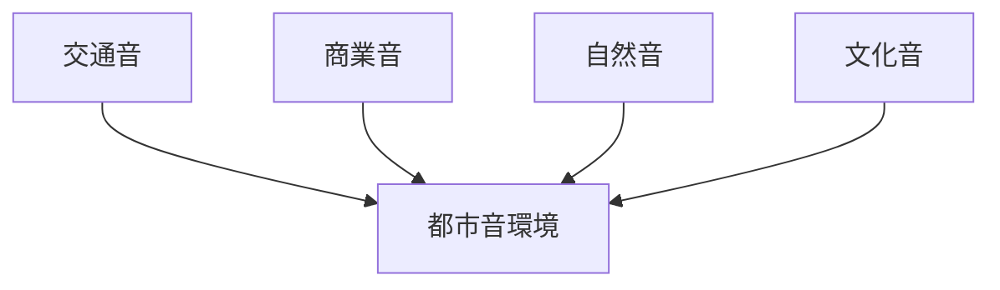

# 音環境観察チェックリスト

## 概要

音環境観察チェックリストとは  
**都市や地域の音環境を観察するためのチェックリスト**である。

音は

- 都市活動
- 交通
- 商業
- 文化

を反映する。

音環境は

都市の雰囲気  
観光体験  

に大きく影響する。

---

# 音環境の基本構造

---

# 1 交通音

観察項目

- 車
- 電車
- バス

確認ポイント

- 騒音
- 静寂

---

# 2 商業音

観察項目

- 店舗音楽
- 呼び込み

確認ポイント

- 商業活気
- 繁華街

---

# 3 自然音

観察項目

- 川
- 風
- 鳥

確認ポイント

- 静かな環境

---

# 4 文化音

観察項目

- 寺の鐘
- 祭り
- 音楽

確認ポイント

- 地域文化

---

# フィールドワーク質問

1 音の中心はどこか  
2 騒音はどこで発生するか  
3 静かな場所はどこか  

---

# 目的

- 都市雰囲気理解  
- 観光体験理解  

---

# 関連ノート

- [[02_zettelkasten/21_domain/fieldwork_tourism/04_method/07_observation/05_urban_observation/都市観察チェックリスト]]
- [[観光資源評価フレーム]]