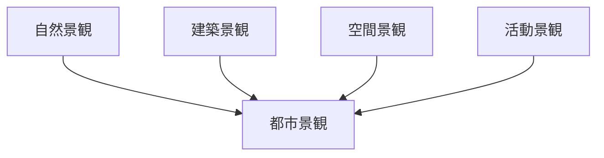
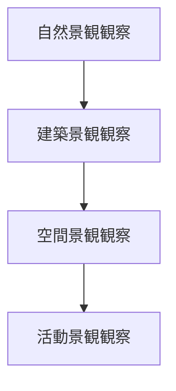

# 景観観察チェックリスト

## 概要

景観観察チェックリストとは  
**都市や地域の景観を観察する際に確認すべき要素を整理したチェックリスト**である。

景観は

- 自然
- 建築
- 空間構造
- 人間活動

によって形成される。

景観観察を通じて

- 都市の特徴
- 歴史的背景
- 観光価値

を理解することができる。

---

## 景観観察の基本構造

---

## 1 自然景観

自然環境が作る景観。

観察項目

- 山
- 河川
- 海
- 森林

確認するポイント

- 景観の背景
- 地形との関係

---

## 2 建築景観

建築による景観。

観察項目

- 建築様式
- 建物高さ
- 建物配置

確認するポイント

- 建築の統一性
- 歴史建築

---

## 3 空間景観

都市空間の構造。

観察項目

- 街路
- 広場
- 視線の抜け

確認するポイント

- 景観軸
- 視点場

---

## 4 活動景観

人間活動による景観。

観察項目

- 商店
- 市場
- 観光客

確認するポイント

- 活動の集中
- 時間変化

---

## 景観要素

景観を構成する主な要素。

- ランドマーク
- 景観軸
- スカイライン
- 視点場

これらは都市景観の特徴を形成する。

---

## 景観観察の順序

---

## フィールドワークでの質問

景観を見るときは次を考える。

1 この景観の特徴は何か  
2 景観を作る要素は何か  
3 景観の中心はどこか  
4 景観の視点はどこか  

---

## 例

### 京都

自然景観

- 山に囲まれる盆地

建築景観

- 寺院建築
- 町家

空間景観

- 碁盤目街路

活動景観

- 観光
- 商業

---

### 金沢

自然景観

- 河岸段丘
- 河川

建築景観

- 武家屋敷
- 茶屋街

空間景観

- 城下町街路

活動景観

- 観光
- 商業

---

## 景観観察の目的

このチェックリストの目的は以下である。

- 景観理解  
- 都市特徴理解  
- 観光価値発見  

---

## 関連ノート

- [[景観読解]]
- [[02_zettelkasten/21_domain/photography/photo_fieldwork/フィールドワーク観察]]
- [[都市レイヤー]]
- [[観光価値]]