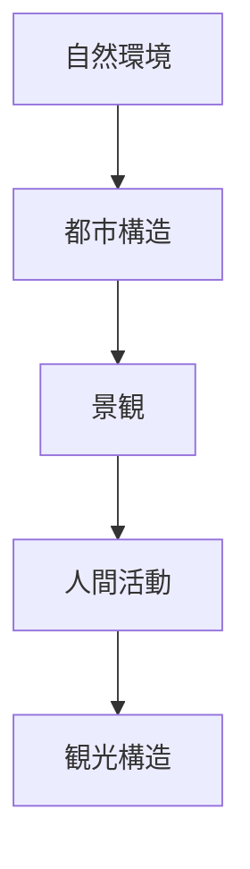
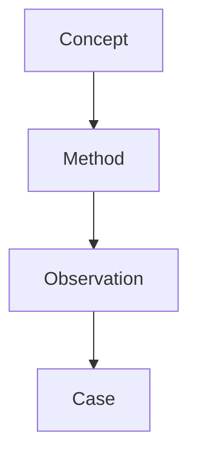
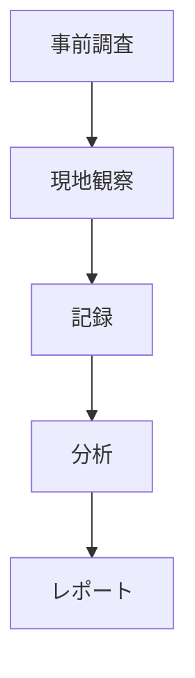

# Fieldwork Tourism Hub

## 概要

Fieldwork Tourism とは  
**現地観察（フィールドワーク）によって地域・都市・観光地を理解するための知識体系**である。

この分野では

- 地形
- 都市構造
- 景観
- 人間活動
- 観光行動

を観察し、地域の意味を読み解く。

---

## フィールドワークの基本構造

---

# Domain Structure

この分野は以下のレイヤーで構成される。

---

# Concept

フィールドワークの基本概念。

- [[02_zettelkasten/21_domain/photography/photo_fieldwork/フィールドワーク観察]]
- [[地形解釈]]
- [[景観読解]]
- [[都市レイヤー]]
- [[観光価値]]

---

# Method

フィールドワークで使用する分析フレーム。

- [[町読みフレーム]]
- [[都市構造分析フレーム]]
- [[観光資源評価フレーム]]
- [[02_zettelkasten/06_domain/fieldwork_tourism/観光動線分析]]

---

# Observation

現地観察チェックリスト。

- [[フィールドワークチェックリスト]]
- [[02_zettelkasten/21_domain/fieldwork_tourism/04_method/07_observation/05_urban_observation/都市観察チェックリスト]]
- [[地形観察チェックリスト]]
- [[景観観察チェックリスト]]
- [[街路観察チェックリスト]]
- [[建築観察チェックリスト]]
- [[商業観察チェックリスト]]
- [[宗教施設観察チェックリスト]]
- [[交通観察チェックリスト]]
- [[観光客観察チェックリスト]]

---

# Case

具体的な観察事例。

例

- [[金沢フィールドワーク]]
- [[京都フィールドワーク]]
- [[鎌倉フィールドワーク]]

Caseでは

- 観察
- 分析
- 写真
- 地図

を記録する。

---

# Fieldwork Workflow

フィールドワークの基本手順。

---

# フィールドワークの目的

フィールドワークの目的は以下である。

- 地域理解  
- 都市構造理解  
- 観光資源発見  
- 観光価値評価  

---

# 関連ノート

- [[02_zettelkasten/21_domain/photography/photo_fieldwork/フィールドワーク観察]]
- [[町読みフレーム]]
- [[観光資源評価フレーム]]
- [[都市レイヤー]]