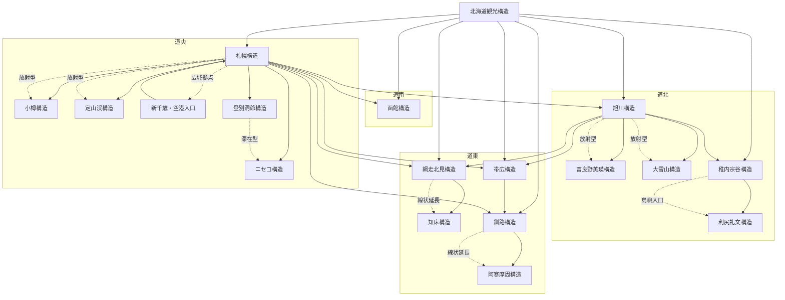

# Summary
都市札幌を拠点に、短距離放射で都市・海・温泉を組み合わせる高効率観光圏

---

# Definition（定義）

- 中心（Hub）：札幌
- 範囲：小樽・定山渓・新千歳空港圏
- スケール：半日〜2日圏

---

# Core Identity（本質）

- テーマ：都市＋近郊自然＋食
- ブランド：北海道都市観光の玄関口
- 差別化：
  - 都市機能と自然が極めて近接
  - 短時間で複数体験が可能

---

# Observation（客観）

## 地理
- 石狩平野中央
- 日本海（小樽）へのアクセス良好

## 交通
- 空港：新千歳空港（約40分）
- 鉄道：札幌駅（JRハブ）
- 都市交通：地下鉄網

## 観光分布
- 都市集中（札幌中心部）
- 放射状に小樽・定山渓

---

# Structure（構造）

## 中心（Hub）
- 札幌（宿泊・商業・交通）

## サブノード

### 強
- [[小樽]]
- [[定山渓]]
### 中
- [[余市]]
### 弱
- [[夕張]]
- [[由仁]]
### 入口ノード
- [[新千歳空港]]
- [[苫小牧]]
- 札幌駅

## 接続（Network）
→ [[交通ネットワーク構造]]

- 函館本線
- 千歳線

## 階層（Hierarchy）
札幌 → 小樽／定山渓 → 周辺自然

---

# Resource Distribution（資源分布）

→ [[都市資源タイプ分類]]

- 点：時計台・運河・温泉街
- 線：札幌駅〜大通〜すすきの軸
- 面：札幌中心市街地
- 時間：雪祭り・冬景観

---

# Circulation（回遊）

## 典型回遊
→ [[回遊パターン]]

- 札幌市内回遊（都市分散）
- 札幌→小樽（放射）
- 札幌→定山渓（放射）

## 回遊特性
- 高連結（鉄道・道路）
- 日帰り回遊可能
- 都市滞在型ベース

---

# Stay Structure（滞在構造）

## 滞在拠点
- 札幌（ほぼ一極集中）

## 滞在日数
- 平均：1〜3日

## 滞在分布
- 都市集中型

---

# Perception（知覚）

## 地域イメージ
- 「北海道の入口都市」
- 「都市と自然のバランス」

## ストーリー
- 開拓都市→観光都市化

## 統一感
- 強い（ブランド明確）

---

# Mechanism（必須）

## Phase 1：資源分布
- 都市資源が札幌に集中
- 自然資源が近郊に分散

## Phase 2：接続
- 高密度交通（JR・バス）
- 空港からの直結性

## Phase 3：Transformation（必須）
- 「地方都市 → 観光ハブ都市」
- 「単一都市 → 複合体験圏」

## Phase 4：Amplification
- 雪祭りなどのイベント
- SNS映え（雪・運河）
- 食文化（海鮮・ラーメン）

## Phase 5：Outcome
- 滞在拠点化
- 高回遊率（日帰り分散）
- 北海道観光の基点

---

# Analysis（外部フレーム）

## 空間
- [[観光圏分析]]
- [[地域構造分析]]

## 動線
- [[観光動線分析]]

## 比較
- [[観光圏比較フレーム]]

---

# Evaluation（評価）

→ [[観光圏評価フレーム]]

## 指標
- 回遊率：高
- 滞在日数：中
- 分散度：中（都市集中＋放射）

## 総合評価
- 非常に効率的な都市型観光圏

---

# Relation（Graph）

- [[札幌観光圏]] #is_a [[観光圏]]
- [[札幌観光圏]] #consists_of [[札幌]]
- [[札幌観光圏]] #contains [[札幌回遊]]
- [[札幌観光圏]] #contains [[小樽回遊]]
- [[札幌観光圏]] #contains [[定山渓回遊]]
- [[札幌観光圏]] #instantiates [[放射型観光圏]]

---

# Script（実務）

## 30秒説明
札幌を拠点に、小樽や温泉地へ日帰りで広がる、都市と自然を効率よく楽しめる観光圏です。

## セールストーク（3分）
札幌観光圏の最大の特徴は「拠点集約型」です。宿泊は札幌に集約され、そこから放射状に小樽や定山渓へアクセスできます。これにより、荷物移動なしで複数の観光体験を組み合わせることが可能です。特にJRによる小樽アクセスと、バスによる温泉アクセスの組み合わせが強力で、短期間でも満足度の高い旅程が設計できます。

## ストーリー
開拓都市として発展した札幌が、交通と商業を核に北海道全体の観光ハブへと進化した。

---

# Pattern（抽象化）

## ■ 構造
中心都市 → 放射接続 → 日帰り回遊 → 拠点滞在

---

# Implications
- 拠点集約型観光の典型モデル
- 荷物移動を減らす設計が有効
- 短期旅行向けの最適構造

---

# Weak Check

- [x] システムとして記述
- [x] 回遊と滞在あり
- [x] Structure/Mechanism分離
- [x] Graph接続あり
- [x] ビジネス利用可能

---

# 一行圧縮
札幌拠点の放射型短距離高効率観光圏