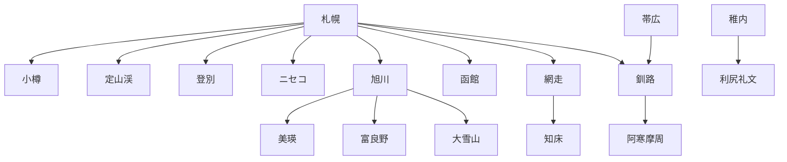
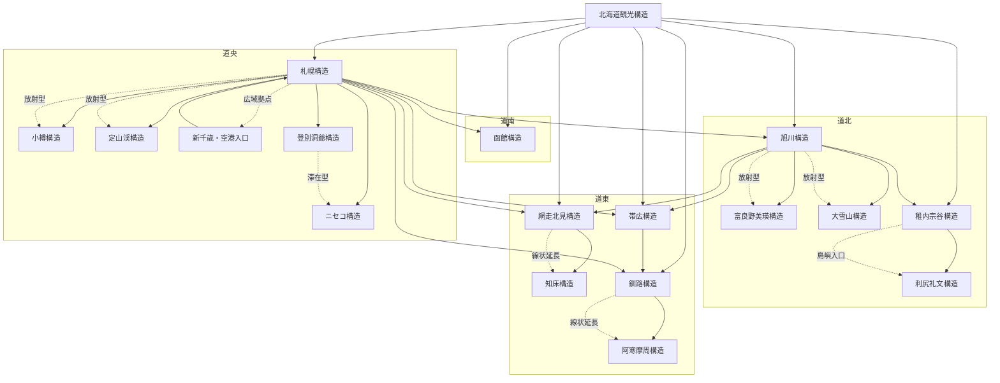

---
id:
title: 北海道観光構造

type: structure_map
layer: system

domain: [tourism]
concept_type: [structure]

# ---- 構造辞書（抽象）
structure_categories:
  - 都市ハブ
  - 自然分散
  - 線状構造
  - 島嶼構造
  - 山岳構造
  - リゾート構造

structure_geometry:
  - 放射型
  - 周回型
  - 線状型
  - 分散型

structure_experience:
  - 都市
  - 自然
  - 温泉
  - 巡礼
  - リゾート

# ---- マップ設定（可視化）
map_scope:
  region: 北海道
  scale: regional

map_layers:
  - structure
  - circulation
  - entry_node

visualization_type:
  - network
  - flow

# ---- データソース
source_structures:
  - [[札幌構造]]
  - [[旭川構造]]
  - [[函館構造]]
  - [[富良野美瑛構造]]
  - [[知床構造]]
  - [[釧路構造]]
  - [[帯広構造]]
  - [[網走北見構造]]
  - [[稚内宗谷構造]]
  - [[利尻礼文構造]]
  - [[登別洞爺構造]]
  - [[ニセコ構造]]

relations:
# - type: visualizes
#   to:
# - type: defines
#   to:

tags:
  - 観光
  - 構造
  - マップ

status: draft
---

# Summary
北海道における観光構造（定義）とその接続関係（マップ）を統合したノート

---

# Structure（定義）

※詳細は各構造ノートへ委譲

- [[札幌構造]]
- [[旭川構造]]
- [[函館構造]]
- [[富良野美瑛構造]]
- [[知床構造]]
- [[釧路構造]]
- [[帯広構造]]
- [[網走北見構造]]
- [[稚内宗谷構造]]
- [[利尻礼文構造]]
- [[登別洞爺構造]]
- [[ニセコ構造]]

---

# Map（構造マップ）

---
# 構造一覧

# 北海道観光構造一覧

| 構造名     | タイプ  | Geometry | Experience | 中心  | 主要ノード      | 主動線       | スケール  | 滞在構造  | アクセス（入口）          | 強度  |
| ------- | ---- | -------- | ---------- | --- | ---------- | --------- | ----- | ----- | ----------------- | --- |
| 札幌構造    | 都市ハブ | 放射型      | 都市＋近郊自然    | 札幌  | 小樽・定山渓・新千歳 | 札幌→小樽/定山渓 | 半日〜2日 | 都市集中  | 空港：新千歳 / 鉄道：札幌    | ★★★ |
| 函館構造    | 都市独立 | 分散型      | 都市＋夜景      | 函館  | 五稜郭・元町     | 市内回遊      | 半日〜1日 | 都市集中  | 空港：函館 / 新幹線：新函館北斗 | ★★★ |
| 旭川構造    | 内陸ハブ | 放射型      | 都市＋自然      | 旭川  | 美瑛・動物園     | 旭川→美瑛     | 半日〜1日 | 都市集中  | 空港：旭川             | ★★★ |
| 富良野美瑛構造 | 自然分散 | 分散型      | 景観・農村      | 富良野 | 美瑛・青い池     | 富良野→美瑛    | 半日〜1日 | 分散    | 鉄道：富良野            | ★★★ |
| 知床構造    | 半島端  | 線状型      | 原生自然       | 知床  | ウトロ・羅臼     | 網走→知床     | 1〜2日  | 滞在型   | 空港：女満別            | ★★★ |
| 釧路構造    | 自然拠点 | 線状型      | 湿原＋湖       | 釧路  | 阿寒湖        | 釧路→阿寒     | 1日    | 都市＋分散 | 空港：釧路             | ★★☆ |
| 帯広構造    | 内陸都市 | 分散型      | 食＋農業       | 帯広  | 十勝平野       | 周辺分散      | 半日〜1日 | 都市    | 空港：帯広             | ★★☆ |
| 小樽構造    | サブ都市 | 線状型      | 港町景観       | 小樽  | 運河・余市      | 札幌→小樽     | 半日    | 日帰り   | 鉄道：小樽             | ★★☆ |
| 登別洞爺構造  | 温泉圏  | 分散型      | 温泉＋火山      | 登別  | 洞爺湖        | 登別→洞爺     | 1〜2日  | 滞在型   | 空港：新千歳            | ★★☆ |
| ニセコ構造   | リゾート | 分散型      | スキー滞在      | ニセコ | スキー場群      | 周辺分散      | 2〜3日  | 滞在型   | 空港：新千歳            | ★★☆ |
| 網走北見構造  | 東部拠点 | 線状型      | 流氷＋自然      | 網走  | 知床         | 網走→知床     | 1日    | 分散    | 空港：女満別            | ★★☆ |
| 稚内宗谷構造  | 北端   | 線状型      | 最果て        | 稚内  | 宗谷岬        | 稚内→宗谷     | 半日〜1日 | 都市    | 空港：稚内             | ★★☆ |
| 利尻礼文構造  | 島嶼   | 分散型      | 島嶼自然       | 利尻  | 礼文         | 島間移動      | 2〜3日  | 滞在型   | フェリー：稚内           | ★★☆ |
| 大雪山構造   | 山岳   | 分散型      | 登山・自然      | 大雪山 | 黒岳・層雲峡     | 山岳分散      | 1〜2日  | 滞在型   | 旭川                | ★★☆ |
| 阿寒摩周構造  | 湖沼   | 分散型      | 湖・火山       | 阿寒湖 | 摩周湖・屈斜路湖   | 湖間移動      | 1〜2日  | 滞在型   | 釧路                | ★★☆ |

---

# 構造マップ

---
# Links
- [[観光圏]]
- [[回遊]]
- [[観光資源辞書]]
- [[交通ネットワーク構造]]