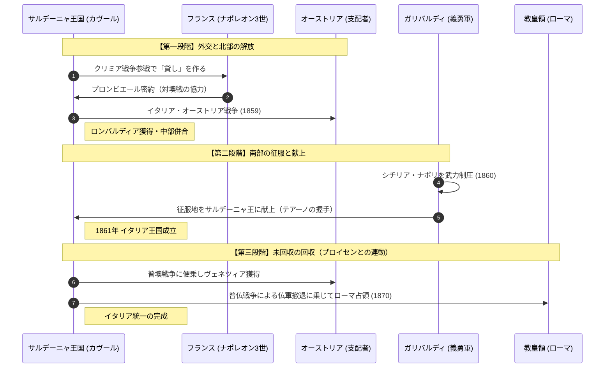

# イタリア統一 (リソルジメント)

## 1. 概念定義 (Definition)
ウィーン体制下でバラバラに解体されていたイタリア半島が、サルデーニャ王国を中心として一つの国民国家へと統合されていく過程。1861年のイタリア王国成立を経て、1870年のローマ占領で完成した。

## 2. 統一の「三要素」（役割分担）

イタリア統一は、以下の「頭脳」「剣」「魂」の相互作用によって成し遂げられました。

| 役割 | 人物 | 属性・戦略 |
| :--- | :--- | :--- |
| **魂 (Soul)** | **マッツィーニ** | 「青年イタリア」を結成。共和制による統一を夢見た理想主義者。 |
| **頭脳 (Brain)** | **カヴール** | サルデーニャ首相。英仏との外交、ビスマルクとの連携を操る現実政治家。 |
| **剣 (Sword)** | **ガリバルディ** | 「赤シャツ隊」を率いた伝説的将軍。武力で南イタリアを征服した英雄。 |

## 3. 統一への動態シーケンス (Sequence)

## 4. ビスマルク（プロイセン）との構造的相関

イタリア統一は、ビスマルクのドイツ統一と**「同期」**してた。

1. **共通の敵（オーストリア）**: イタリアにとっての北部の支配者オーストリアは、プロイセンにとってもドイツの主導権を争うライバルだった。
    
2. **外交的バーター**: カヴール（および後継者）は、ビスマルクがオーストリアやフランスと戦うタイミングに合わせて動くことで、自国の軍事力以上の成果（ヴェネツィアやローマ）を手に入れた。
    
3. **ナポレオン3世のジレンマ**: フランスはイタリアの統一を助けつつも、教皇の保護者としてローマ併合を阻むという矛盾を抱えていた。ビスマルクが普仏戦争でナポレオン3世を倒したことで、この「重石」が外れ、イタリアはローマを手に入れた。
    

## 5. 分析リレーション (Relations)

- `utilizes` [[クリミア戦争]] (カヴールが国際社会にデビューした舞台)    
- `coordinates_with` [[普墺戦争]] (ヴェネツィア獲得のチャンス)    
- `finalizes_via` [[普仏戦争]] (フランスの軍事的空白を利用したローマ併合)    

---

## 6. 考察：理想と現実の「テアーノの握手」

1860年、共和制を信奉するガリバルディが、自ら征服した南イタリアをサルデーニャ王ヴィットーリオ・エマヌエーレ2世に差し出した「テアーノの握手」は、イタリア史最大のドラマである。 これは、**「革命（ガリバルディ）」が「国家（王権）」に服従した瞬間**であり、内乱を避けて統一を優先したガリバルディの無私無欲な決断が、イタリアという「OS」を一つにまとめ上げた。

---

## 7. ログ

- 2026-03-26: 「頭脳・剣・魂」の三要素を中心に構造化。