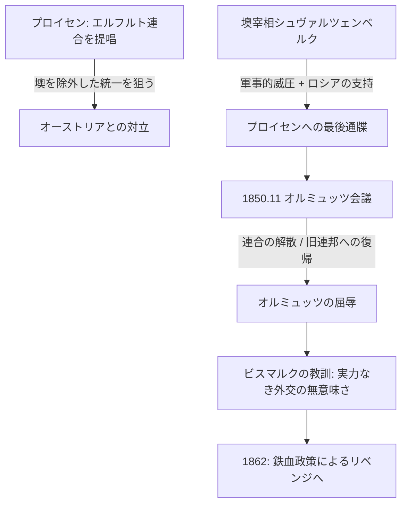

# オルミュッツの屈辱 (1850)

## 1. 概念定義 (Definition)
1850年11月、プロイセン王国がオーストリア帝国の軍事的圧力を受け、自ら主導した「エルフルト連合（プロイセン中心のドイツ統合案）」を放棄し、オーストリア主導の「ドイツ連邦」への復帰を認めた外交的敗北。

## 2. 構造的背景：なぜ「屈辱」となったのか

### A. 1848年革命後の真空状態
- フランクフルト国民議会が失敗した後、プロイセン王フリードリヒ・ヴィルヘルム4世は「上からの統一」を画策した。
- これに対し、オーストリアの宰相**シュヴァルツェンベルク**は、ウィーン体制（勢力均衡）の復活を求めて激しく対立。

### B. 物理的実力の格差
- ヘッセン・カッセル州での暴動介入を巡り、両国は動員を開始。
- プロイセン軍は準備不足を露呈。一方、オーストリアはロシア帝国の支持を取り付けていた。
- **孤立無援のプロイセン**: 物理的な「鉄と血」が足りない状態で外交カードを切った結果、詰んでしまった状態。

## 3. 動態フローチャート (Dynamics)

## 4. 各主体の反応と教訓

|**主体**|**反応・影響**|**分析**|
|---|---|---|
|**国王フリードリヒ・ヴィルヘルム4世**|精神的打撃|正統主義（君主間の信義）が通用しない現実を突きつけられた。|
|**プロイセン軍部 (ローン等)**|屈辱と復讐心|軍制改革の絶対的必要性を痛感。1866年の普墺戦争への原動力。|
|**若きビスマルク**|**あえて現状維持を支持**|当時は「準備不足の戦争は避けるべき」と冷徹に判断。しかし、「次は力で勝つ」と決意。|

## 5. 分析リレーション (Relations)

- `reverts` [[諸国民の春]] (革命の成果を完全に消去し、1815年の状態へ戻す)    
- `motivates` [[鉄血演説]] (「オルミュッツの再来」を絶対に許さないという執念)    
- `leads_to` [[普墺戦争]] (16年後の「オルミュッツ」の清算)    

---

## 6. 考察：ビスマルクの「逆張り」演説

この屈辱的な講和に対し、プロイセン議会は激昂した。しかし、当時議員だったビスマルクは演説で「強国の名誉とは、強国にふさわしい時機を選んで戦争することにある」と述べ、あえて講和を擁護した。
これは「感情（屈辱感）」で動くのではなく、「勝てる算段（実力）」が整うまで頭を下げるという、彼の徹底した現実政治（Realpolitik）の原点であった。

---

## 7. ログ

- 2026-03-26: ドイツ統一前夜の「トラマ」として構造化。