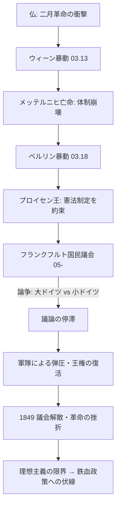

# 三月革命 (1848)

## 1. 概観 (Overview)
1848年3月、フランス二月革命の影響を受け、ウィーンやベルリンを中心に発生した一連の革命運動。ウィーン体制の象徴であるメッテルニヒが失脚し、ドイツ諸邦では自由主義的改革とナショナルな統一（ドイツ統一）を目指す動きが加速した。

## 2. 構造的メカニズム (Mechanism)

### A. 象徴の崩壊（メッテルニヒ失脚）
- **ウィーン暴動**: 1848.03.13、学生や市民の蜂起により、30年間欧州を凍結させてきたメッテルニヒがイギリスへ亡命。
- **ドミノ倒し**: ウィーン体制の「脳」が停止したことで、ハンガリー（コシュート）、イタリア（マッツィーニ）、ベルリンなどで一斉に独立・改革運動が爆発した。

### B. ドイツ統一への挑戦（フランクフルト国民議会）
- **目的**: 自由主義的な憲法に基づくドイツの国家統一。
- **ボトルネック**: 「大ドイツ主義（墺を含む）」か「小ドイツ主義（普中心、墺を除く）」かという**範囲設定（Scope）の対立**により、議論が迷走した。

## 3. 動態フローチャート (Dynamics)

## 4. 革命の成果と挫折の要因

|**項目**|**内容**|**分析**|
|---|---|---|
|**封建的特権の廃止**|農民解放の進展|物理的な旧体制の解体は一部進んだ。|
|**憲法意識の定着**|憲法制定への期待|「法による統治」が民衆の共通言語に。|
|**失敗の主因**|**「小ドイツ主義」の拒絶**|プロイセン王が「民衆から与えられる王冠」を拒否（正統主義への固執）。|

## 5. 分析リレーション (Relations)

- `terminates` [[ウィーン体制]] (メッテルニヒの物理的排除)    
- `leads_to` [[オットー・フォン・ビスマルク]]の登場 (「議論や多数決では解決できない」という教訓)    
- `triggers` [[アウスグライヒ]] (オーストリア帝国が内部のナショナリズムに対応せざるを得なくなる)    

---

## 6. 考察：理想主義の「バグ」

フランクフルト国民議会は、知識人たちが「理想の国」を議論することに時間を費やしすぎ、その間に軍隊（物理的な力）を握る君主たちが体制を立て直す時間を与えてしまった。
「正当性は議会にある」というソフト面と、「正当性は銃口にある」というハード面の乖離が、この革命を失敗に終わらせた。

---

## 7. ログ

- 2026-03-25: 諸国民の春の核心部として構造化。