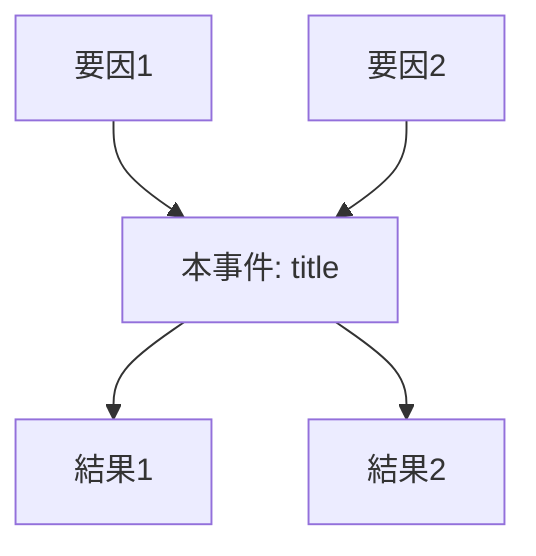

---
note_type:
  - case
layer:
  - case
status:
  - stable
maturity:
  - draft
domain: history
related: []
problem_type:
  - information
  - power
  - coordination
created: {{date}}
updated: {{date}}
---

# {{title}}

## 1. 事件の分類と概要 (Taxonomy & Overview)
- **事件型 (Event Type)**: (例: 引き金事件 / 潮流事件 / 構造的転換点 / 収束事件 / 盲目的破局)
- **発生時期**: 
- **主要な場所**: 
- **関連主体 (Actors)**: [[主体A]], [[主体B]]

## 2. メカニズムとリレーション (Mechanism & Relations)

### 因果の連鎖 (Causal Chain)
- **直接的要因 (`caused_by`)**: [[直前の事象]] (例: ビスマルクによる電報編集)
- **構造的背景 (`explains`)**: [[背後の理論・構造]] (例: フランス第二帝政の内部正当性の不安)
- **結果・影響 (`catalyzes` / `triggers`)**: [[その後の変化]] (例: 普仏戦争の勃発)

### 構造の変化 (Structural Shift)
- **置換 (`replaces`)**: [[旧システム]] → [[新システム]]
- **制約 (`constrained_by`)**: なぜ他の選択肢（平和的解決など）が選べなかったか。

## 3. 統合プロセス図 (Integrated Process Diagram)

## 4. パターン分析と現代への示唆 (Pattern Analysis)

- **抽出される型 (`instance_of`)**: [[抽象的なパターン名]] (例: 面子の罠 / 情報の武器化)    
- **類推 (`analogous_to`)**: 現代のどの事象（SNS、ビジネス、現代政治）に構造が似ているか。    
- **反実仮想 (Counter-factual)**: もしどの変数が違えば、結末は変わっていたか。

---

## 5. ログ

- {{date}}: テンプレートに基づき作成。