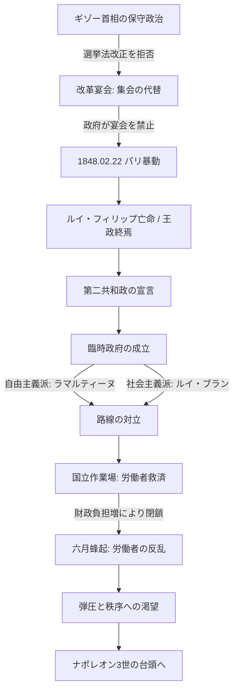

# 二月革命 (1848)

## 1. 概観 (Overview)
1848年2月、パリの民衆が七月王政（ルイ・フィリップ）を打倒した革命。これによりフランスに「第二共和政」が成立し、ウィーン体制（メッテルニヒ体制）は欧州全域で崩壊の連鎖を始めた。

## 2. 構造的背景：なぜ起きたのか (Background)

### A. 七月王政の「ロックイン」
- **極端な制限選挙**: 有権者は全人口のわずか1%（大地主・大資本家のみ）。
- **ギゾー首相の放言**: 選挙権を求める中小市民に対し「労働して金持ちになれ、そうすれば有権者になれる」と突き放し、対話を拒絶した（情報の不一致）。

### B. 階級構造の変化
- **産業革命の進展**: 労働者階級（プロレタリアート）が急増し、社会主義思想が浸透。「パンと仕事」を求める生存本能が政治的エネルギーへ転換。

## 3. 動態フローチャート (Dynamics)

## 4. 革命の成果と限界

|**項目**|**内容**|**影響**|
|---|---|---|
|**男性普通選挙制**|21歳以上の全男性に投票権|欧州初の画期的な民主化。|
|**社会主義の登場**|臨時政府にルイ・ブランが参画|「労働権」が初めて政治の議論の遡上に載る。|
|**保守化への反動**|六月蜂起の鎮圧|農民や市民が「混乱」を恐れ、秩序を求めて後の帝政（ナポレオン3世）を支持する皮肉な結果に。|

## 5. 分析リレーション (Relations)

- `triggers` [[諸国民の春]] (ドイツ、オーストリア、イタリア等への連鎖)    
- `terminates` [[ウィーン体制]] (メッテルニヒの失脚を誘発)    
- `leads_to` [[ナポレオン3世のクーデター]] (混乱後の「強い指導者」への期待)    

---

## 6. 考察：システムの「過負荷」

二月革命後の臨時政府は、**「自由主義（政治的権利）」**と**「社会主義（経済的生存権）」**という、当時としては処理しきれないほど高度なパケットを同時に扱おうとした。この二つのOSの競合が「六月蜂起」というシステムクラッシュを招き、皮肉にも人々は再び「強い権威（ナポレオンの甥）」という古いプロトコルに回帰することになった。

---

## 7. ログ

- 2026-03-25: ウィーン体制崩壊のトリガーとして構造化。