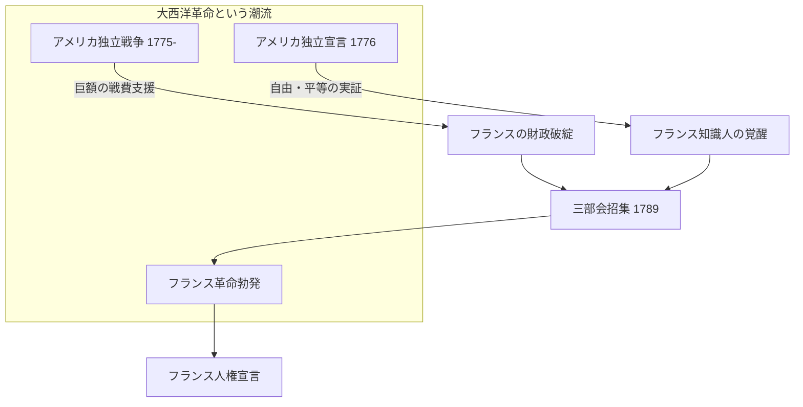

## アメリカ独立戦争

```mermaid
graph TD
    USA_War[アメリカ独立戦争 1775-] -- "巨額の戦費支援" --> Fra_Debt[フランスの財政破綻]
    USA_Dec[アメリカ独立宣言 1776] -- "自由・平等の実証" --> Fra_Intel[フランス知識人の覚醒]
    
    Fra_Debt --> Estates[三部会招集 1789]
    Fra_Intel --> Estates
    
    Estates --> Fra_Rev[フランス革命勃発]
    Fra_Rev --> Rights[フランス人権宣言]
    
    subgraph Atlantic_Revolution [大西洋革命という潮流]
        USA_War
        USA_Dec
        Fra_Rev
    end
```
