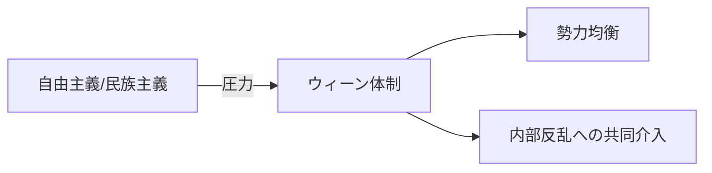
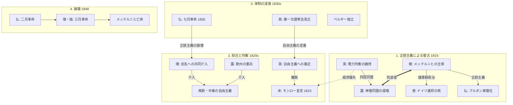

# ウィーン体制：正統主義と勢力均衡
## システムのメカニズム
- **五国同盟**: 英・露・墺・普・仏による「欧州の協調(Concert of Europe)」。
- **抑圧の論理**: 自由主義運動を「病」と見なし、共同で外科手術（軍事介入）を行う。
## メカニズム図

```mermaid
graph LR
    Vienna[ウィーン体制] --> Balance[勢力均衡]
    Vienna --> Intervention[内部反乱への共同介入]
    Liberalism[自由主義/民族主義] -- "圧力" --> Vienna
```

## 大陸間動態

```mermaid
graph TD
    %% 縦軸（時間軸）の定義
    subgraph Phase_1_Restoration [1. 正統主義による復古 1815-]
        F_V[仏: ブルボン家復位]
        E_V[英: 勢力均衡の維持]
        A_V[墺: メッテルニヒの主導]
        P_V[普: ドイツ連邦の核]
        R_V[露: 神聖同盟の提唱]
        
        A_V -- "正統主義" --> F_V
        E_V -- "四国同盟" --> R_V
        A_V -- "議事録政治" --> P_V
    end

    subgraph Phase_2_Suppression [2. 抑圧と均衡 1820s]
        A_S[墺: 反乱への共同介入]
        R_S[露: 欧州の憲兵]
        E_S[英: 自由主義への接近]
        
        A_S & R_S -- "介入" --> Revolt[南欧・中東の自由主義]
        E_S -- "離脱" --> Monroe[米: モンロー宣言 1823]
    end

    subgraph Phase_3_Erosion [3. 体制の浸食 1830s]
        F_E[仏: 七月革命 1830]
        E_P[英: 第一次選挙法改正]
        B_I[ベルギー独立]
        
        F_E -- "正統主義の崩壊" --> A_S
        E_P -- "自由主義の定着" --> E_S
    end

    subgraph Phase_4_Collapse [4. 崩壊 1848]
        Feb[仏: 二月革命]
        Mar[墺・独: 三月革命]
        Met_Fall[メッテルニヒ亡命]
        
        Feb --> Mar
        Mar --> Met_Fall
    end

    %% 横方向の構造的関係
    A_V <== "防波堤" ==> R_V
    E_V -. "経済優先" .-> Monroe
```

