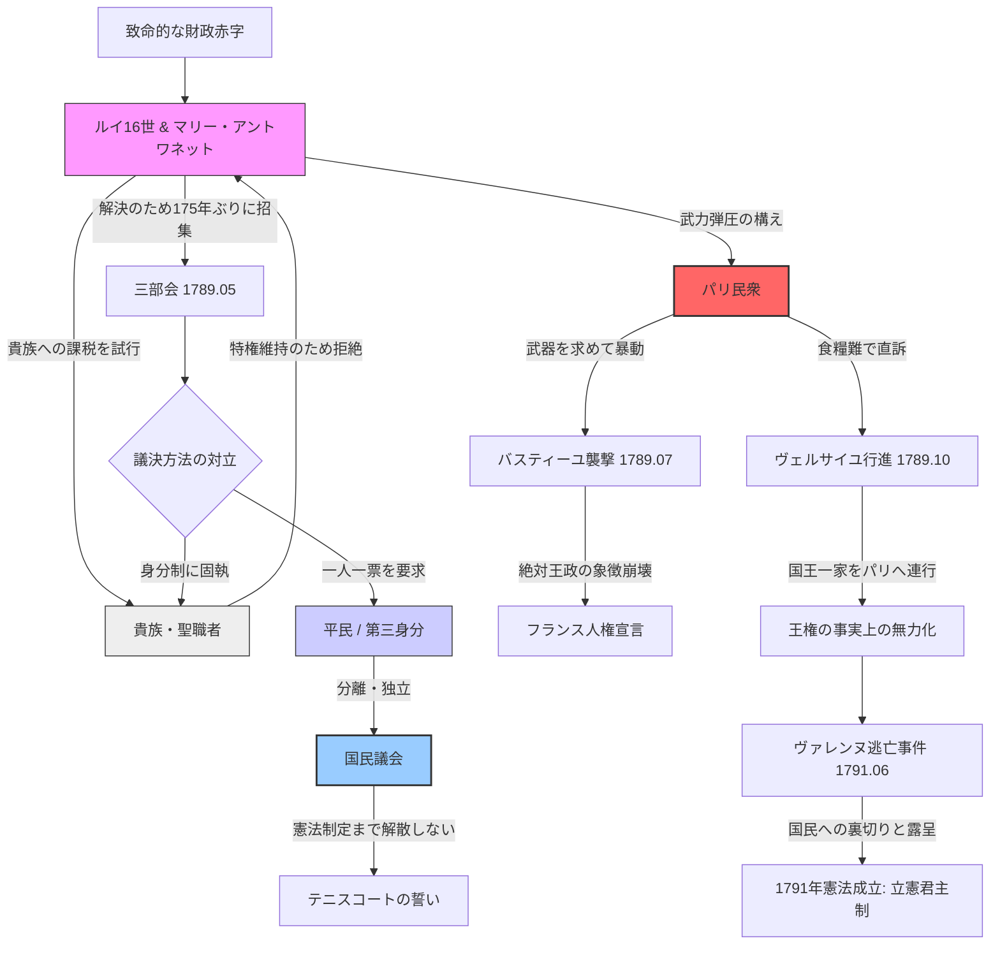

# ナポレオン体制：革命の輸出と帝政
## 構造的特徴
- **国民軍の衝撃**: 傭兵ではなく「祖国」のために戦う国民の誕生。
- **ナポレオン法典**: 私有財産の不可侵と法の下の平等という近代OSの配布。
## 動態図解
### 1. 革命の勃発：システム崩壊と「国民」の誕生 (1789-1791)
timeline
    title 1789-1791: 旧体制の崩壊と近代OSのインストール
    1789.05 : 三部会招集 : 財政破綻による特権階級への課税試行（失敗）
    1789.06 : テニスコートの誓い : 第三身分（平民）が自らを「国民議会」と定義。正当性の奪取。
    1789.07 : バスティーユ襲撃 : 民衆の武力介入。物理的な旧体制破壊の象徴。
    1789.08 : 封建的特権の廃止 : 貴族・教会の特権を法的に抹消。
            : フランス人権宣言 : 「自由・平等・主権在民」という新社会の設計図。
    1789.10 : ヴェルサイユ行進 : パリ民衆が国王一家をパリへ連行。王権の物理的拘束。
    1790.07 : 聖職者民事基本法 : 教会を国家の管理下に。宗教権威の解体。
    1791.06 : ヴァレンヌ逃亡事件 : 国王が国外脱出を試み失敗。国民による「裏切り」の確信。
    1791.09 : 1791年憲法制定 : フランス初の憲法。立憲君主制の成立。

