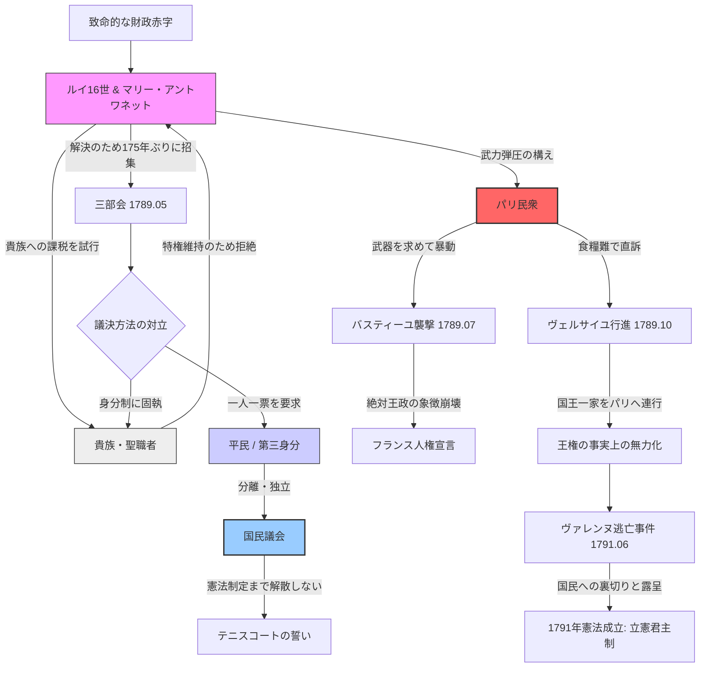
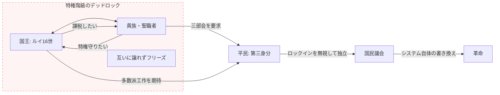
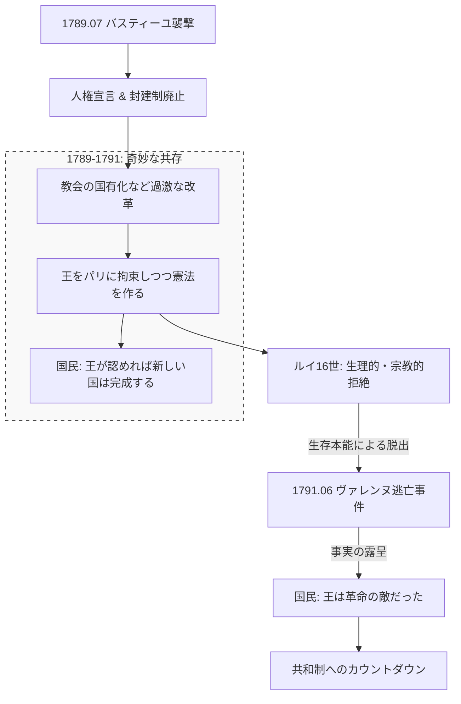
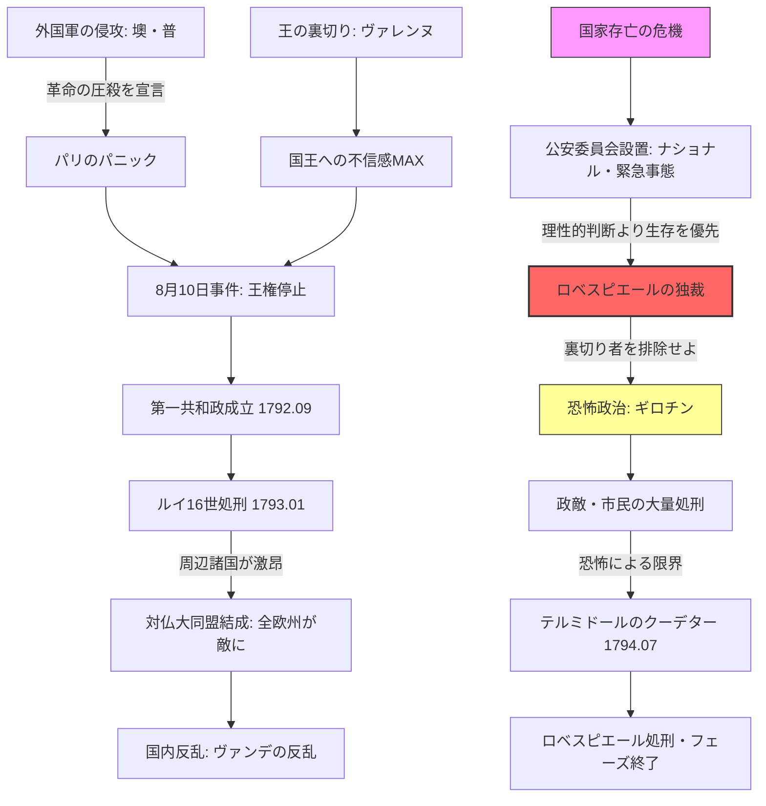
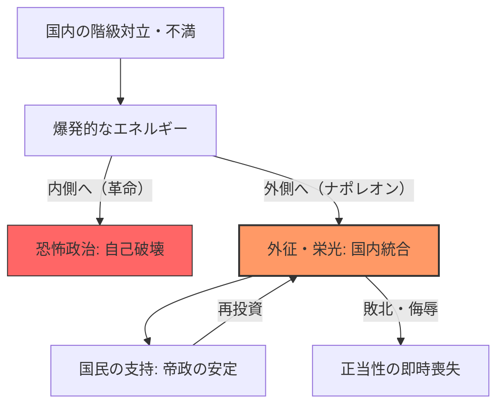
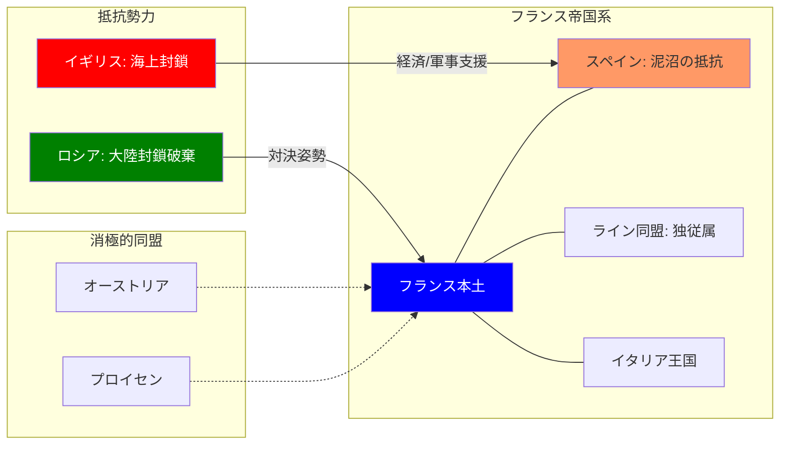

# ナポレオン体制：革命の輸出と帝政
## 構造的特徴
- **国民軍の衝撃**: 傭兵ではなく「祖国」のために戦う国民の誕生。
- **ナポレオン法典**: 私有財産の不可侵と法の下の平等という近代OSの配布。
## 動態図解
### 1. 革命の勃発：システム崩壊と「国民」の誕生 (1789-1791)
#### 概略
timeline
    title 1789-1791: 旧体制の崩壊と近代OSのインストール
    1789.05 : 三部会招集 : 財政破綻による特権階級への課税試行（失敗）
    1789.06 : テニスコートの誓い : 第三身分（平民）が自らを「国民議会」と定義。正当性の奪取。
    1789.07 : バスティーユ襲撃 : 民衆の武力介入。物理的な旧体制破壊の象徴。
    1789.08 : 封建的特権の廃止 : 貴族・教会の特権を法的に抹消。
            : フランス人権宣言 : 「自由・平等・主権在民」という新社会の設計図。
    1789.10 : ヴェルサイユ行進 : パリ民衆が国王一家をパリへ連行。王権の物理的拘束。
    1790.07 : 聖職者民事基本法 : 教会を国家の管理下に。宗教権威の解体。
    1791.06 : ヴァレンヌ逃亡事件 : 国王が国外脱出を試み失敗。国民による「裏切り」の確信。
    1791.09 : 1791年憲法制定 : フランス初の憲法。立憲君主制の成立。

#### 三部会のロックイン構造と国民議会

#### 「国民の父」への絶望

## 激化と恐怖政治のメカニズム

## ボナパルティズムのエネルギー循環

## 構造的比較：敵のベクトルと統合のメカニズム

|**統治フェーズ**|**敵の所在**|**統合の道具**|**結末**|
|---|---|---|---|
|**革命（フェーズ2）**|**内部**（反革命分子）|ギロチン・恐怖|相互不信による自壊|
|**ナポレオン1世**|**外部**（対仏大同盟）|軍事的勝利・大陸軍|欧州制覇と遠征失敗|
|**ナポレオン3世**|**外部**（ロシア・プロイセン）|外交的威信・植民地|エムス電報事件と崩壊|

## ナポレオン・ボナパルトの軌跡
timeline
    title 1799-1815: ナポレオンの台頭から没落まで
    section 1. 権力掌握と国内整備 (1799-1804)
        1799.11 : ブリュメール18日のクーデター : 総裁政府を倒し実権掌握（第一総領）
        1801.07 : コンコルダート(教務協定) : カトリック教会と和解し国内を安定化
        1804.03 : ナポレオン法典発布 : 近代市民社会のOSを法的に固定
        1804.12 : 皇帝即位 : 「フランス人民の皇帝」として革命を継承
    section 2. 欧州制覇と絶頂 (1805-1807)
        1805.10 : トラファルガーの海戦 : ネルソン提督に敗北（イギリス上陸を断念）
        1805.12 : アウステルリッツの戦い : 露・墺を撃破（三帝会戦）。大陸の覇権確定。
        1806.07 : ライン同盟結成 : 神聖ローマ帝国が消滅。ドイツ再編。
        1806.11 : 大陸封鎖令 : イギリスを経済的に孤立させる「実力政治」の発動
        1807.07 : ティルジット条約 : 露・普と講和。ナポレオン帝国の絶頂期。
    section 3. 綻びと泥沼化 (1808-1812)
        1808.05 : スペイン戦争勃発 : 民衆のゲリラ戦に苦しむ「スペインの潰瘍」
        1812.06 : ロシア遠征開始 : 60万の大軍による遠征。焦土作戦に直面。
        1812.12 : モスクワ撤退 : 冬将軍と追撃により壊滅的被害（帰還者は数万人）
    section 4. 没落と百日天下 (1813-1815)
        1813.10 : ライプツィヒの戦い : 諸国民戦争で敗北。包囲網の完成。
        1814.04 : 退位・エルバ島流刑 : パリ陥落。ブルボン王政復古。
        1815.03 : 百日天下 : エルバ島を脱出しパリへ帰還。
        1815.06 : ワーテルローの戦い : ウェリントン率いる連合軍に完敗。
        1815.10 : セントヘレナ島流刑 : 孤島での終身流刑。ナポレオン時代の完全終焉。

