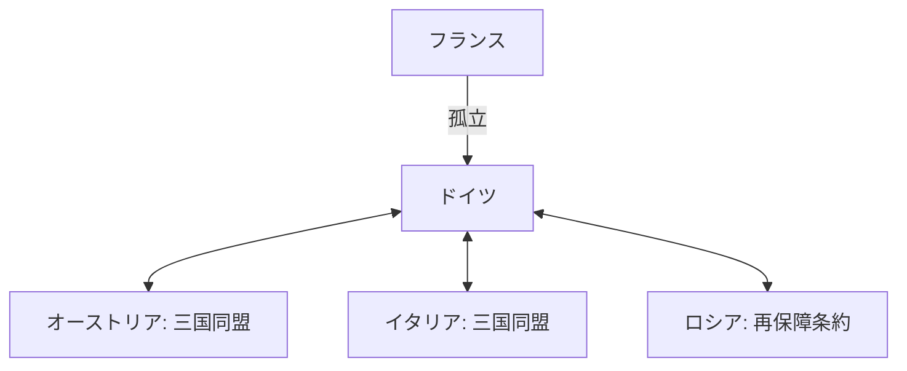

# ビスマルク体制：欧州の誠実な仲介人
## 戦略的インセンティブ
- **フランスの孤立化**: 普仏戦争の復讐を防ぐための徹底した封じ込め。
- **二正面作戦の回避**: ロシアとの関係維持を最優先する。
## 同盟網の構造

```mermaid
graph TD
    Ger[ドイツ] <--> Aut[オーストリア: 三国同盟]
    Ger <--> Ita[イタリア: 三国同盟]
    Ger <--> Rus[ロシア: 再保障条約]
    Fra[フランス] -- "孤立" --> Ger
```
