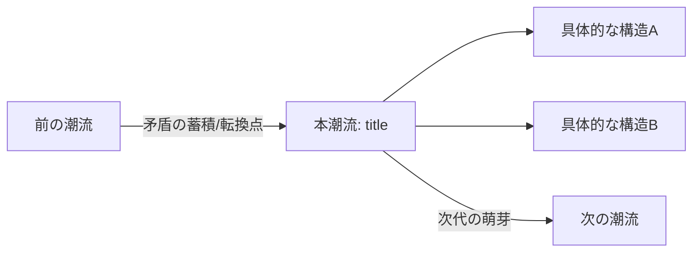

---
note_type:
  - epoch
layer:
  - case
status:
  - stable
maturity:
  - draft
domain: history
related: []
problem_type:
  - coordination
  - information
  - power
created: {{date}}
updated: {{date}}
---

# {{title}}

## 1. 潮流の定義と範囲 (Definition & Scope)
- **種別**: (例: 思想的潮流 / 経済的パラダイム / 国際秩序)
- **中心的な期間**: 
- **主要な舞台**: (例: 全欧州 / 大西洋世界 / 東アジア文化圏)

## 2. パラダイムのメカニズム (Paradigm Mechanism)

### 支配的価値観 (Dominant Values)
- **正当性の根拠**: その時代、何が「正しい」とされていたか（例: 自由、秩序、信仰、進歩）。
- **共通言語**: 当時の人々が世界を理解するための枠組み（例: ナショナリズム、資本主義、科学的合理性）。

### 駆動要因 (Drivers)
- **技術・経済的基盤**: `supported_by` [[技術/制度]] (例: 印刷術、蒸気機関、植民地経済)。
- **知的源泉**: `derived_from` [[思想家/著作]] (例: 啓蒙思想、社会進化論)。

## 3. 動態リレーション (Dynamic Relations)
- **包含する構造**: `contains` [[構造 (Structure)]] (例: [[ナショナリズム]] `contains` [[国民国家システム]])。
- **代表的な主体**: `represented_by` [[主体 (Actor)]]。
- **定着の契機**: `established_by` [[潮流事件 (Event)]]。
- **対抗軸**: `conflicts_with` [[対立する潮流]] (例: [[自由主義]] `conflicts_with` [[正統主義]])。

## 4. 潮流の変化図 (Transition Diagram)

## Gemini の回答

歴史ドメイン・オントロジーにおける**「潮流 (Epoch / Trend)」**のノートテンプレートを作成しました。

このテンプレートは、個別の事件や人物を包み込み、それらに「方向性」や「意味」を与える**時代のOS（パラダイム）**を記述するためのものです。

---

### テンプレート：歴史上の潮流 (Epoch / Trend)

Markdown

````
---
note_type:
  - epoch
layer:
  - case
status:
  - stable
maturity:
  - draft
domain: history
related: []
problem_type:
  - coordination
  - information
  - power
created: {{date}}
updated: {{date}}
---

# {{title}}

## 1. 潮流の定義と範囲 (Definition & Scope)
- **種別**: (例: 思想的潮流 / 経済的パラダイム / 国際秩序)
- **中心的な期間**: 
- **主要な舞台**: (例: 全欧州 / 大西洋世界 / 東アジア文化圏)

## 2. パラダイムのメカニズム (Paradigm Mechanism)

### 支配的価値観 (Dominant Values)
- **正当性の根拠**: その時代、何が「正しい」とされていたか（例: 自由、秩序、信仰、進歩）。
- **共通言語**: 当時の人々が世界を理解するための枠組み（例: ナショナリズム、資本主義、科学的合理性）。

### 駆動要因 (Drivers)
- **技術・経済的基盤**: `supported_by` [[技術/制度]] (例: 印刷術、蒸気機関、植民地経済)。
- **知的源泉**: `derived_from` [[思想家/著作]] (例: 啓蒙思想、社会進化論)。

## 3. 動態リレーション (Dynamic Relations)
- **包含する構造**: `contains` [[構造 (Structure)]] (例: [[ナショナリズム]] `contains` [[国民国家システム]])。
- **代表的な主体**: `represented_by` [[主体 (Actor)]]。
- **定着の契機**: `established_by` [[潮流事件 (Event)]]。
- **対抗軸**: `conflicts_with` [[対立する潮流]] (例: [[自由主義]] `conflicts_with` [[正統主義]])。

## 4. 潮流の変化図 (Transition Diagram)
```mermaid
graph LR
    Old[前の潮流] -- "矛盾の蓄積/転換点" --> Current[本潮流: {{title}}]
    Current --> Sub1[具体的な構造A]
    Current --> Sub2[具体的な構造B]
    Current -- "次代の萌芽" --> Next[次の潮流]
````

## 5. パターン分析 (Pattern Analysis)

- **普遍的な型**: (例: 「世俗化」「グローバル化」「帝国の膨張」)。
    
- **類推 (`analogous_to`)**: 現代のどのような「時代の空気」や「トレンド」に構造が似ているか（例: デジタル化、脱炭素など）。
    

---

## 6. ログ

- {{date}}: テンプレートに基づき作成。