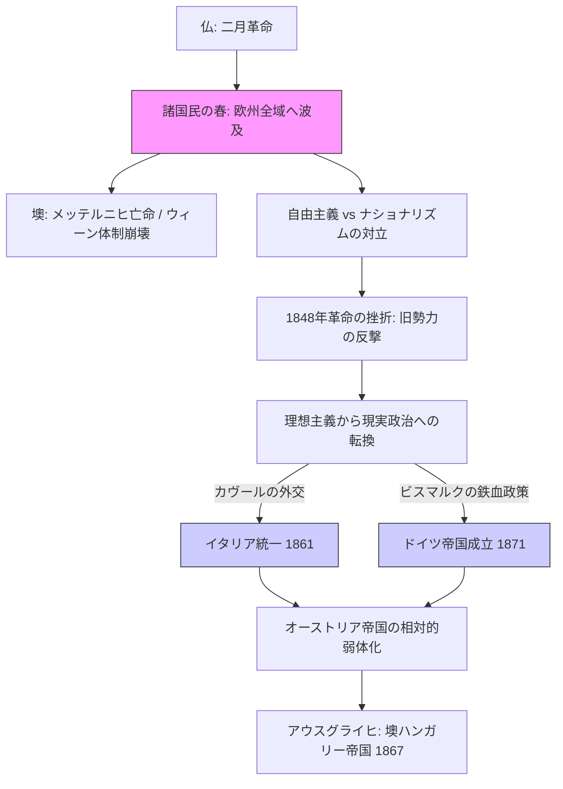

# 諸国民の春と国家統合 (1848-1871)

## 1. 概観 (Overview)
1815年から続くウィーン体制が「1848年革命」によって物理的に崩壊。当初は民衆による「自由と民主主義」の運動として始まったが、失敗を経て、後半期には「強力な指導者によるトップダウンの国家統合」へと変質した。

## 2. 動態フローチャート：熱狂から統合へ

## 3. 二つの「国家統合」のメカニズム

### A. イタリアの統合 (Risorgimento)

- **主体 (Actor)**: サルデーニャ王国（カヴール首相）、ガリバルディ（赤シャツ隊）。    
- **戦略**: 外交による大国（仏）の利用と、下からの武力闘争の合流。    
- **結果**: 1861年、イタリア王国成立。    

### B. ドイツの統合 (German Unification)

- **主体 (Actor)**: プロイセン王国（ビスマルク首相）。    
- **戦略**: **「鉄血政策」**。デンマーク、オーストリア、フランスとの三つの戦争を勝ち抜く「凱旋門政治」の再来。    
- **結果**: 1871年、ドイツ帝国成立。欧州の勢力均衡が根本から書き換えられた。    

## 4. 構造的変化：正当性の移行

- **Before (ウィーン体制)**: 正当性の根拠は「伝統と血統（正統主義）」。    
- **After (1871年以降)**: 正当性の根拠は「民族の同一性と軍事的・経済的実力（ナショナリズム・国力）」。    

## 5. 分析リレーション (Relations)

- `invalidates` [[ウィーン体制]] (現状維持メカニズムの消失)   
- `triggers` [[新帝国主義]] (統合された強国による対外膨張の開始)    
- `replaces` [[欧州協調]] → [[秘密同盟網（ビスマルク体制）]]    

---

## 6. 考察：1848年の「遺産」

1848年革命そのものは「失敗」に終わった（多くが再び君主制に戻った）ように見える。しかし、この時爆発した「ナショナリズム」というパケットは、もはやウィーン体制の古いプロトコルでは処理できなくなっていた。ビスマルクやカヴールは、このエネルギーを「憲法と軍隊」という新しい器に盛り付けることで、近代国家という強固なシステムを完成させたのである。

---

## 7. ログ

- 2026-03-25: ウィーン体制崩壊からドイツ・イタリア統一までの流れを構造化。