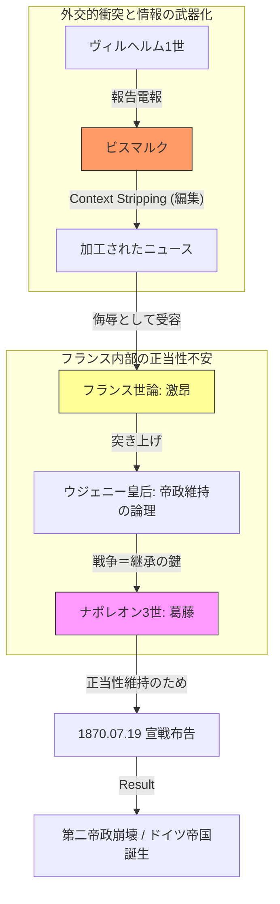

---
note_type:
  - case
layer:
  - case
status:
  - stable
maturity:
  - draft
domain: history
related:
  - オットー・フォン・ビスマルク
  - なぽれおｐ
  - [[Empress-Eugenie]]
  - [[Second-French-Empire]]
  - [[Radical-Republicanism]]
problem_type:
  - power
  - information
  - coordination
  - incentive
created: 2026-03-07
updated: 2026-03-07
---

# エムス電報事件 (Ems Dispatch Incident)

## 1. Entity Classification
- **Type**: `Event` (外交的・情報的トリガー)
- **Actors**: 
    - [[Bismarck]] (操作者)
    - [[Napoleon-III]] (決断者/病身)
    - [[Empress-Eugenie]] (強硬派/内部圧力)
    - [[Wilhelm-I]] (受動的当事者)
- **Structure**: [[Second-French-Empire]] (内部正当性に不安を抱える政体)
- **Concept**: [[Nationalism]], [[The-Prestige-Trap]]

## 2. Mechanism & Relations
本事件の核心は、**「情報の武器化」が「構造的脆弱性」を突いた**点にある。

### Semantic Relations (Ontology Based)
- **`instance_of`**: [[Trigger-Event-Pattern]]
- **`caused_by`**: [[Context-Stripping]] (ビスマルクによる電報編集)
- **`catalyzes`**: [[Franco-Prussian-War]] (潜在的矛盾の爆発)
- **`constrained_by`**: [[Public-Opinion-Pressure]] (ナポレオン3世の選択肢を奪った要因)
- **`explains`**: [[Internal-Legitimacy-Anxiety]] (なぜフランスが暴走したかの理論的背景)

### 統合メカニズム図 (Integrated Process)

## 3. Pattern Analysis: 内部正当性の不安

急進的、あるいは基盤の不安定な政体が抱える「構造的欠陥」の典型例である。

1. **Prestige Trap (面子の罠)**: 伝統的権威を欠く政体は、外部からの侮辱を無視できない。無視は「弱さ」と見なされ、即座に内部崩壊（革命）に直結するため、不利益を承知で強硬策を選ばざるを得ない。
2. **Predictability (予測可能性)**: ビスマルクはフランスのこの「構造的弱点」を正確に把握していた。情報の微細な加工が、相手を特定の行動（宣戦布告）へ自動的に誘導するレバーとなった。

## 4. Analogies & Insights

- **Modern Analogy**: SNSにおける「切り取り（Context Stripping）」による炎上と、それに抗えず過剰反応する組織・個人の構図。
- **Counter-factual**: もしフランスに「伝統的・安定的な正当性」があれば、この程度の挑発は外交交渉で処理可能であったはずである。

---

## 5. Log

- 2026-03-25: 歴史ドメインOntologyに基づき再構成。