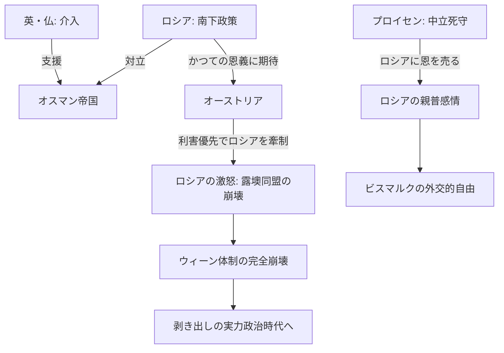

# クリミア戦争 (1853-1856)

## 1. 概念定義 (Definition)
オスマン帝国の領土（聖地管理権）を巡るロシアの南下政策に対し、英・仏・サルデーニャがオスマン帝国側で参戦した大規模な近代戦争。ウィーン体制（欧州協調）が実質的に崩壊し、大国間の利害が剥き出しになった。

## 2. 三つの視点による構造的解釈

| 視点 | 目的・動機 | 帰結 (Result) |
| :--- | :--- | :--- |
| **英・仏** | ロシアの地中海進出阻止（東方問題） | ロシアの南下を凍結。パリ条約で黒海中立化を実現。 |
| **ロシア** | 汎スラヴ主義・不凍港の獲得 | 敗北による国内近代化（農奴解放）の開始。 |
| **プロイセン** | **静観（中立）の維持** | **最大の勝者**。露・墺の離反により外交的空白地帯を獲得。 |

## 3. プロイセン視点：露墺の「鉄の同盟」解体

プロイセン（特に若きビスマルク）にとって、この戦争は「千載一遇のチャンス」だった。

### A. オーストリアの「恩を仇で返す」裏切り
- 1848年革命時、ロシアはオーストリアのハンガリー反乱鎮圧を助けた「恩人」であった。
- しかしクリミア戦争時、オーストリアはロシアを助けず、むしろ武装中立でロシアを背後から牽制。
- **結果**: ロシアの対墺感情が最悪化。1815年以来の「神聖同盟（露墺普の保守同盟）」が永久に破壊された。

### B. プロイセンの戦略的中立
- 国内では「英仏派」と「ロシア派」が激突したが、プロイセンは中立を死守。
- **結果**: ロシアにとって、プロイセンは「苦境でも背中を刺さなかった唯一の隣国」となり、後のドイツ統一戦争（普墺・普仏）でのロシアの中立を勝ち取る伏線となった。

## 4. 動態フローチャート (Dynamics)

