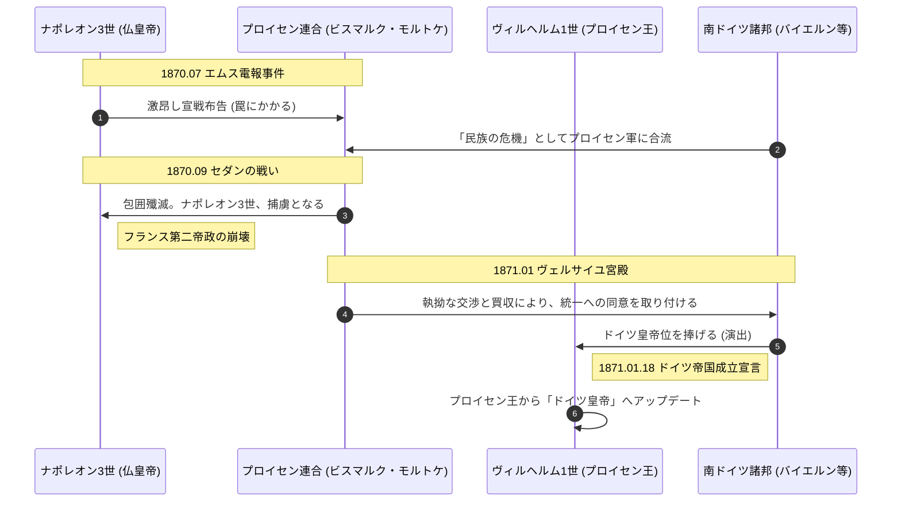

# 普仏戦争 (Franco-Prussian War)

## 1. 概念定義 (Definition)
プロイセン率いるドイツ諸邦連合と、ナポレオン3世率いるフランス帝国の戦争。プロイセンが圧勝し、ナポレオン3世を捕虜とした。この勝利により、ヴェルサイユ宮殿でドイツ帝国の成立が宣言された。

## 2. 戦略的メカニズム：ビスマルクの「誘い」

| 段階 | アクション | 狙い |
| :--- | :--- | :--- |
| **1. 挑発** | エムス電報事件の編集・公開 | フランスの世論を激昂させ、フランス側から「宣戦布告」させる。 |
| **2. 統合** | 南ドイツ諸邦の参戦 | 「フランスの侵略」という構図を作り、反プロイセン的だった南ドイツを「ドイツ民族」として統合。 |
| **3. 孤立** | 各国への中立工作 | ロシア・オーストリア・イギリスを静観させ、フランスを1対多（独連合）の状態にする。 |


## 3. 動態シーケンス
### 1：帝国の誕生とナポレオンの没落



### 2： 1870-1871 第二帝政崩壊と国防政府の苦闘
```mermaid
sequenceDiagram
    autonumber
    participant Nap3 as ナポレオン3世 (捕虜)
    participant Paris as パリ市民 (民衆)
    participant DefGov as フランス国防政府 (共和派)
    participant Bism as ビスマルク (独首相)
    participant King as ヴィルヘルム1世 (プロイセン王)

    Note over Nap3, Bism: 1870.09.02 セダンの降伏
    activate Nap3
    Nap3->>Bism: 「余の剣を陛下に捧げる」
    deactivate Nap3
    Note right of Nap3: [System Terminated] 第二帝政の崩壊
    
    Note over Paris, DefGov: 1870.09.04 パリ内部での連動
    Paris->>Paris: 皇帝の廃位を宣言（革命）
    
    create participant DefGov as フランス国防政府
    Paris-->>DefGov: [生成] 「共和政を樹立し、祖国を救え！」
    activate DefGov
    
    Note over DefGov, Bism: パリ包囲戦 (1870.09-)
    Bism->>DefGov: 「アルザス・ロレーヌを割譲せよ」
    DefGov->>Bism: 「1インチの土地も渡さない！」
    
    Note over Bism, DefGov: 物理的遮断（餓死作戦）
    Bism->>DefGov: パリを完全封鎖。補給路をカット
    
    Note over Paris, DefGov: 【内部の亀裂】
    Paris->>DefGov: 「食料が尽きた。なぜ打って出ないのか！」
    Paris->>Paris: ネズミや動物園の動物（象）を食べる極限状態
    DefGov->>Bism: 隠密裏に休戦交渉を開始（市民には内緒）
    
    Note over Bism, King: 1871.01.18 システムの完成
    Bism->>King: ヴェルサイユ宮殿「鏡の間」で戴冠式
    King->>King: [Node Update] ドイツ皇帝に即位
    
    Note over DefGov, Bism: 1871.02 フランクフルト講和
    Bism->>DefGov: 50億フランの賠償金と領土を要求
    DefGov->>Bism: 「条件を呑む（屈辱の受諾）」
    deactivate DefGov
    
    Note over Paris, DefGov: 破局へ
    Paris->>DefGov: 「裏切り者め！」（パリ・コミューンの蜂起へ）
```
