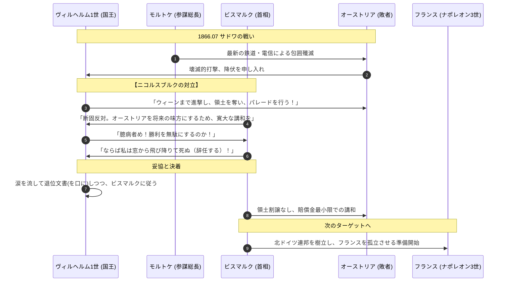

# 普墺戦争 (七週間戦争)

## 1. 概念定義 (Definition)
プロイセンとオーストリアの間で戦われた、ドイツの主導権を巡る最終決戦。プロイセンがわずか7週間で圧勝し、オーストリアをドイツからパージ（排除）したことで、ドイツ統一の形態が「小ドイツ主義」に確定した。

## 2. ビスマルクの「完全包囲網（開戦前工作）」

| 方角 | 対象 | 工作内容 | 目的 |
| :--- | :--- | :--- | :--- |
| **南** | イタリア | 秘密同盟の締結 | 二正面作戦を強いてオーストリア軍を分散させる。 |
| **東** | ロシア | クリミア戦争の恩売り | ロシアを中立に固定し、背後の安全を確保。 |
| **西** | フランス | ナポレオン3世への誘惑 | 「領土代償」を期待させ、参戦を遅らせる。 |

## 3. 動態シーケンス：軍事の勝利と政治の抑制

