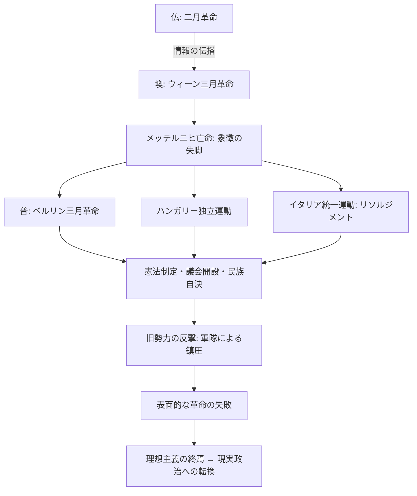
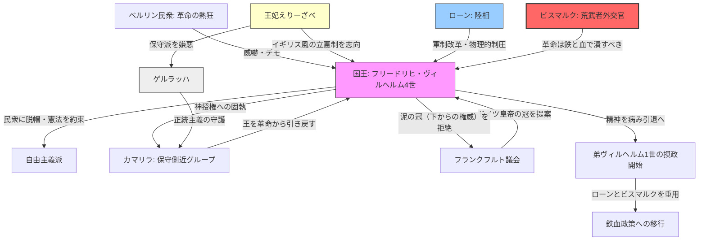

# 諸国民の春 (Spring of Nations / 1848年革命)

## 1. 概念定義 (Definition)
1848年にフランスの二月革命を導火線として、オーストリア、ドイツ、イタリア、ハンガリーなどヨーロッパ各地で同時多発的に発生した革命の総称。ウィーン体制を物理的に崩壊させ、近代国家形成の決定的なトリガーとなった。

## 2. 構造的メカニズム：なぜ「同時多発」したのか

### A. 共通の敵：ウィーン体制の抑圧
- **「正当性」のミスマッチ**: 君主たちは「血統（正統主義）」を主張したが、民衆は「民族の一致（ナショナリズム）」と「市民の権利（自由主義）」を求めた。

### B. 情報の高速同期 (Information Sync)
- **鉄道と電信の普及**: パリでの革命成功のニュースが、かつてない速さで欧州各地へ伝播。各地の不満分子に「今こそ変えられる」という**心理的同期**を引き起こした。

### C. 生存本能の爆発
- **ジャガイモ飢饉と不況**: 1840年代後半の経済危機が、労働者や農民の怒りを限界まで高めていた（経済的ベースラインの崩壊）。

## 3. 動態フローチャート：連鎖のプロセス

## 4. 各地の影響比較

|**地域**|**主な動き**|**結果と教訓**|
|---|---|---|
|**フランス**|第二共和政成立|社会主義の台頭と、その後のナポレオン3世による保守化。|
|**オーストリア**|メッテルニヒ追放|多民族帝国の維持が困難に（アウスグライヒへの伏線）。|
|**ドイツ**|フランクフルト国民議会|理想主義的な「議論」による統一の限界を露呈。|
|**イタリア**|マッツィーニの共和政|外部勢力（仏・墺）の介入により失敗。武力の必要性を痛感。|

## 5. 分析リレーション (Relations)

- `invalidates` [[ウィーン体制]] (現状維持メカニズムの完全な死)    
- `leads_to` [[ビスマルクの鉄血政策]] (「多数決ではなく鉄と血」という教訓)    
- `catalyzes` [[ナショナル・アイデンティティの形成]]    

---

## 6. 考察：美しい「春」と残酷な「結末」

「諸国民の春」は、短期的には軍隊によって鎮圧され、多くの亡命者を生んだ「失敗した革命」に見える。しかし、この時放出された「民族の自律」というエネルギーは、もはやどの君主も元に戻す（再封印する）ことはできなかった。
1848年は、ヨーロッパが「君主の所有物」から「国民の国家」へとOSを書き換え始めた、不可逆的な転換点である。

---

## 7. ログ

- 2026-03-25: 1848年革命を「システム崩壊」の視点から構造化。