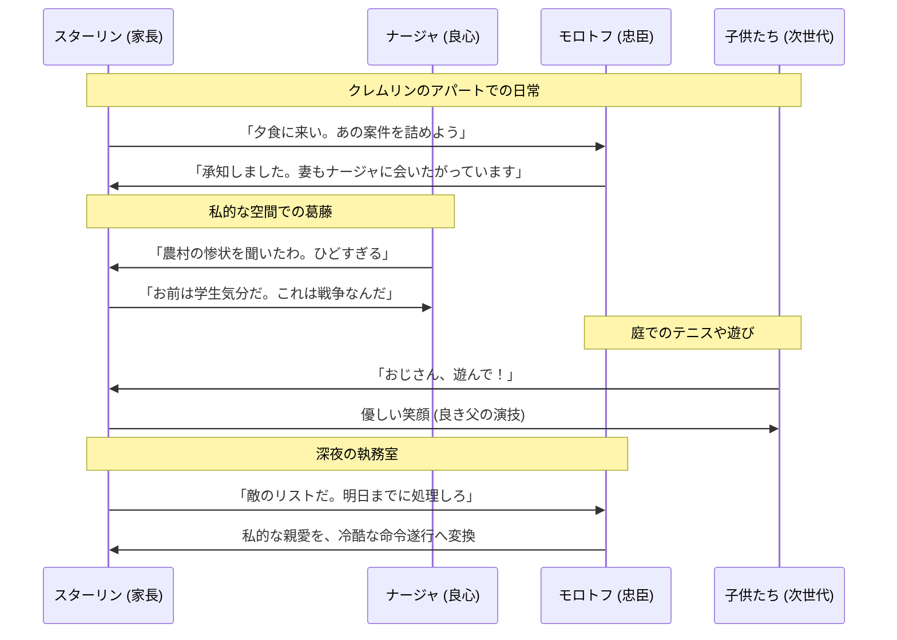

# クレムリン・ファミリー：独裁を支える疑似家族の構造

## 1. 概念：赤い貴族の「共生社会」
1920年代末から30年代初頭にかけて、スターリンとその側近（廷臣）たちは、モスクワのクレムリン内や、近郊の別荘（ダチャ）で文字通り「屋根の下を共にする」生活を送っていた。これは単なる職住接近ではなく、独裁を維持するための「インフォーマルな統治機構」として機能していた。

- **公私混同の極致**: 政治局の公式会議と同じくらい、夕食会、ビリヤード、テニスといった私的な交流の場での「ささやき」が意思決定に重きを置いた。
- **相互監視と情愛**: 互いの妻は親友であり、子供たちは兄弟のように育つ。この親密さが、後に「裏切り」を万死に値する罪（家族への背信）へと昇華させる心理的トラップとなった。

## 2. 主要な「ファミリー」のプロファイリング
スターリン（家長）を取り巻く、初期メンバーの役割分担。

| 名前 | 役割・性格 | スターリンとの絆 |
| :--- | :--- | :--- |
| **ナージャ** | 皇后 / 良心 | 第2妻。ファミリーの精神的支柱。唯一「人間」としてスターリンを繋ぎ止めていた。 |
| **モロトフ** | 筆頭執事 / 事務 | 「鉄の尻」。事務処理能力と絶対的忠誠。スターリンの影。 |
| **ヴォロシーロフ** | 騎士 / 遊び仲間 | 戦友。軍事能力は低いが、スターリンと冗談を言える数少ない「友人」。 |
| **カガノーヴィチ** | 執行官 / 暴力 | 鉄道・建設担当。命令を「熱狂的かつ残酷に」実行する鉄腕。 |
| **ミコヤン** | 補給官 / 実務 | 抜け目のない実務家。ファミリーの「胃袋（食糧供給）」を守る。 |
| **オルジョニキゼ** | 兄弟 / 直言士 | グルジア以来の親友。スターリンに反対意見を言える唯一の男。 |

## 3. 政治力学：恩顧と恐怖の共依存
この「ファミリー」を維持していたのは、単なる友情ではなく、計算された**「恩顧（パトロネージ）」**である。

1. **特権の供与**: 飢饉で国民が苦しむ中、ファミリーには最高の食材、豪華な別荘が与えられた。
2. **忠誠の証明**: 特権を維持するためには、スターリンのいかなる気まぐれも「正義」としなければならない。
3. **「家族」という名の足枷**: 自分が失脚すれば、隣に住む妻も子供も道連れになる。この「物理的な近さ」が、沈黙と服従を強制した。

## 4. 人間関係のダイナミズム（Sequence Diagram）

