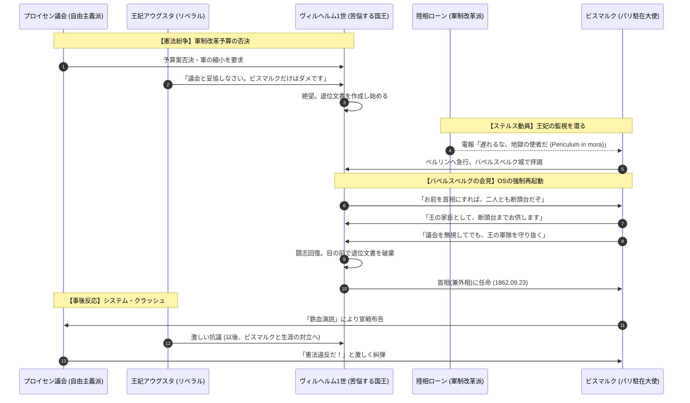

# ビスマルク首相任命 (1862)

## 1. 概念定義 (Definition)
1862年9月、プロイセン国王ヴィルヘルム1世が、軍制改革予算を巡る議会との対立（憲法紛争）に行き詰まり、退位を覚悟した極限状態において、駐仏大使**オットー・フォン・ビスマルク**を首相（兼外相）に任命した事件。

## 2. 構造的メカニズム：なぜ「危機」となったのか

### A. 憲法紛争 (Constitutional Crisis)
- **軍制改革 (Army Reform)**: 陸相**ローン**が推進。兵役延長と常備軍増強を目指す（物理的実力の強化）。
- **議会の抵抗**: 自由主義派が多数を占める下院は、軍部の肥大化を恐れ、予算案を否決。
- **デッドロック**: 国王は「軍の指揮権は王にある」と主張し、議会は「予算審議権は議会にある」と主張。**正当性の衝突**によりシステムがフリーズした。

### B. 宮廷内の権力闘争
- **アウグスタ王妃の介入**: 自由主義的なアウグスタは、議会との妥協を王に迫り、ビスマルク登用に猛反対。王を精神的に追い詰めた（情報のノイズ）。
- **王の絶望**: 「議会に屈するか、退位するか」の二択を迫られ、退位文書を作成。

## 3. 時系列グラフ：絶望からの逆転 (Mermaid)

## 4. ビスマルクの「デバッグ」手法

ビスマルクは、フリーズしたシステムに対し、**「空隙説（Lückentheorie）」**という強引なパッチ（論理）を当てた。

- **論理**: 「憲法には、王と議会の意見が一致しない場合の規定がない（空隙がある）。その場合、国家の運営を止めるわけにはいかないため、王が最終的な決定権を持つ（OSの強制再起動）。」
    
- **実行**: 予算なしで税を徴収し、軍制改革を断行。これにより、プロイセンは「議会主導」ではなく**「首相主導の専制」**へとOSを書き換えられた。
    

## 5. 分析リレーション (Relations)

- `buffers` [[オルミュッツの屈辱]] (二度と屈服しないための軍事力強化)    
- `terminates` [[宮廷内の自由主義]] (アウグスタ妃の政治的敗北)
- `catalyzes` [[鉄血演説]] (就任直後の所信表明)    

---

## 6. 考察：ローンという「影の功労者」

ビスマルクの登用は、陸相ローンなしにはあり得ませんでした。ローンは、王が絶望して退位を口にする中で、アウグスタ妃の監視を潜り抜け、パリにいるビスマルクに「今すぐ来い」と電報（情報のパス）を送り続けました。彼こそが、プロイセンを「実力（鉄と血）」のOSへと切り替えた**システムの管理者（SysAdmin）**でした。

---

## 7. ログ

- 2026-03-26: ドイツ帝国の「起点」として構造化。

