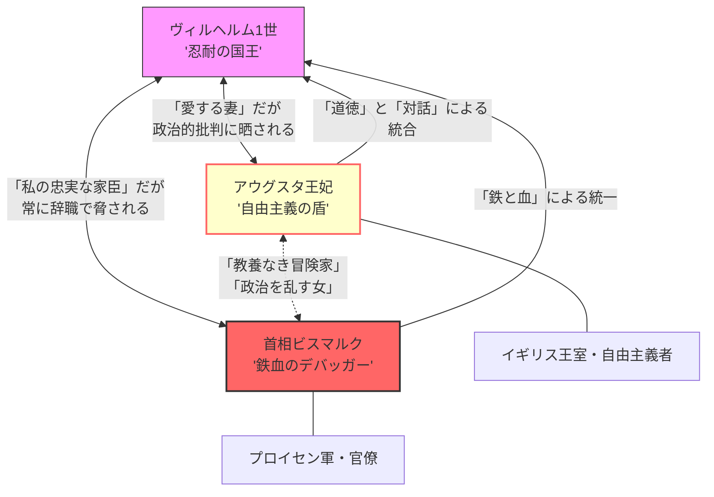

# プロイセン宮廷の権力トライアングル：鉄血と理想の衝突

## 1. 概念概観 (Overview)
プロイセンの最高意思決定機関において、実力政治（Realpolitik）を推進するビスマルクと、イギリス型自由主義を標榜するアウグスタ王妃が、ヴィルヘルム1世の「正当性」を奪い合った構造。

## 2. 三者の動態関係図 (Mermaid)

## 3. 個別プロファイルと戦略 (Actor Profiles)

### A. ヴィルヘルム1世 (The Balancer)

- **性格**: 誠実な軍人、保守的だが優柔不断。    
- **ジレンマ**: ビスマルクの「結果」は必要だが、彼の「手法」が招く家庭内（王妃）や国際的な批判に疲れ果てていた。    
- **名言**: 「ビスマルクの下で皇帝でいることは、並大抵のことではない」    

### B. アウグスタ王妃 (The Liberal Opposition)

- **背景**: 文豪ゲーテの教養を受け継ぐワイマール公国出身。    
- **OS**: イギリスのような「立憲君主制」と「平和外交」を理想とする。    
- **対ビスマルク戦略**:    
    - 王の寝室や食卓でビスマルクの「無謀さ」を批判し続ける。        
    - 自分の息子（後のフリードリヒ3世）を自由主義的に教育し、ビスマルクの「次代」を潰そうとする。       

### C. ビスマルク (The Power Player)

- **OS**: 王権神授説を信奉するが、手段は極めて現実的（Realpolitik）。    
- **対王妃戦略**:    
    - **「情報の遮断」**: 王妃を政治的決定から徹底的に排除する。        
    - **「辞職戦術」**: 王が王妃の意見に傾きかけると「ならば辞めさせていただきます」と脅し、王をロックイン（選択の余地なし）させる。        

## 4. 構造的対立点 (Conflicts)

|**対立軸**|**アウグスタ（理想）**|**ビスマルク（現実）**|
|---|---|---|
|**統一手法**|ドイツの人々を「説得」する|他国を「打倒」して併合する|
|**軍事予算**|議会と妥協すべき|議会を無視しても徴収すべき|
|**対英関係**|親密な同盟（親戚関係）|常に疑い、利用する対象|

## 5. 分析リレーション (Relations)

- `buffers` [[憲法紛争]] (王と議会の衝突をビスマルクが強行突破)    
- `leads_to` [[ヴィルヘルム2世のトラウマ]] (祖父と母の確執を見て育ったことが後のビスマルク解任へ)    

---

## 6. 考察：システムの「ノイズ」としての王妃

ビスマルクにとって、アウグスタは「外敵」よりも厄介な「内なる敵」でした。彼は王妃を、政治を感情的にかき乱す「ノイズ」と見なしていましたが、実際にはアウグスタは**「近代市民社会に適応できないプロイセンの古い体質」**への警告を発し続けていたとも言えます。この二人の不仲が、ドイツ帝国の「軍事優先」という歪んだOSを固定化させる一因となりました。

---

## 7. ログ

- 2026-03-25: ビスマルク時代の宮廷ダイナミクスを構造化。