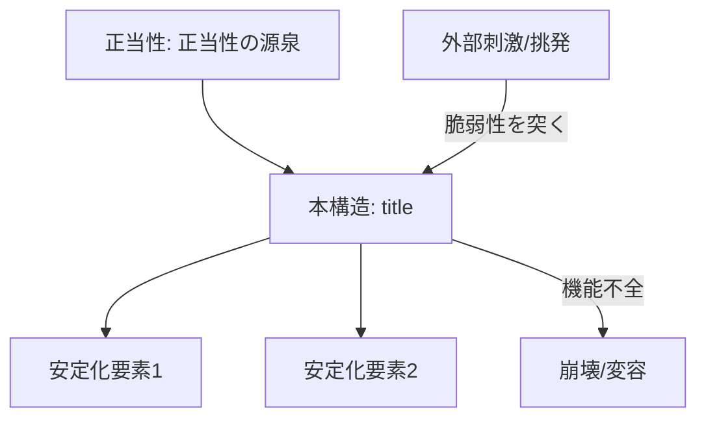

---
note_type:
  - structure
layer:
  - case
status:
  - stable
maturity:
  - draft
domain: history
related: []
problem_type:
  - power
  - coordination
  - information
created: {{date}}
updated: {{date}}
---

# {{title}}

## 1. 構造の定義と基盤 (Definition & Foundation)
- **種別**: (例: 政体 / 経済システム / 法体系 / 階級構造)
- **存続期間**: 
- **正当性の源泉 (Legitimacy Source)**: (例: 血統・伝統 / 民意・選挙 / 革命的成果 / 宗教的権威)

## 2. システムのメカニズム (System Mechanism)

### 安定化要素 (Stabilizers)
- **維持装置**: (例: 官僚機構 / 軍隊 / 経済成長による配分)
- **上位概念**: `part_of` [[時代・潮流]]

### 構造的脆弱性 (Structural Vulnerabilities)
- **内部矛盾**: (例: 自由主義と専制の乖離 / 財政の硬直化)
- **制約要因 (`constrained_by`)**: [[外部勢力]] / [[内部勢力]]
- **ボトルネック**: この構造が崩壊する際の「急所」はどこか。

## 3. 動態リレーション (Dynamic Relations)
- **支配的主体**: `governed_by` [[主要な主体 (Actor)]]
- **置換 (`replaces`)**: [[旧構造]]
- **説明 (`explains`)**: [[本構造が原因で起きた事件 (Event)]]
    - (例: フランス第二帝政 `explains` エムス電報事件での暴走)

## 4. 構造の統合図 (System Diagram)

## 5. パターン分析 (Pattern Analysis)

- **抽象的な型**: (例: 「ボナパルティズム」「封建制」「中央集権」)    
- **類推 (`analogous_to`)**: 現代のどの組織構造（企業文化、現代政治、プラットフォーム）にメカニズムが似ているか。    

---

## 6. ログ

- {{date}}: テンプレートに基づき作成。