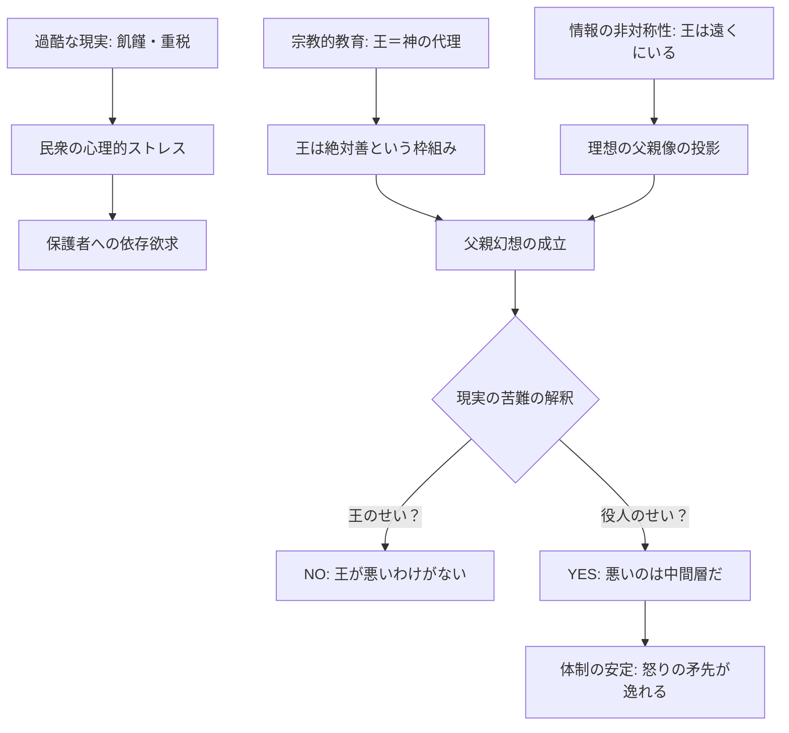

# 父親幻想 (Little Father Myth)

## 1. 概念定義 (Definition)
統治者（王、皇帝、カリスマ的指導者）を、実態とは無関係に「過酷な現実から民衆を守ってくれる慈悲深い父」と見なす集団心理。不満の矛先を「中間層（役人・貴族）」に限定し、「頂点（君主）」の正当性を保護する強力な心理的防衛装置。

## 2. 成立のメカニズム (Genesis Mechanism)

### A. 心理的生存戦略 (Psychological Survival)
- **責任の回避**: 圧倒的な困難に対し、「全能の父」を想定することで、民衆は自ら解決する絶望的な負担から心理的に逃避（幼児退行）できる。
- **希望の維持**: 「王様がこの惨状を知れば助けてくれる」という仮定は、最悪の状況下での精神的支柱となる。

### B. 情報の非対称性と「遠さ」の魔力 (Information Asymmetry)
- **理想化の投影**: 対象が「遠く」にいて直接見えないほど、民衆の「こうあってほしい」という欲望を投影しやすくなる。
- **防波堤理論**: 中間層が不都合な情報を遮断しているという事実は、皮肉にも「王は無実（知らされていないだけ）」という物語を補強する。

### C. 宗教的OS (Religious Framework)
- **王権神授説**: 「王＝神の代理」という前提があるため、王が「悪」であることは論理的に不可能とされ、不利益は「悪徳な家臣による歪曲」と解釈される（認知的不協和の解消）。

## 3. 崩壊のプロセス：正当性の死 (The Pivot of Collapse)

### トリガー：情報の同期 (Synchronization)
幻想は、君主自らが「私はお前たちの敵である」という**否定不可能な直接的情報**を発信した瞬間に崩壊する。

1. **直接的暴力**: 皇帝の軍が嘆願する民衆に発砲する（例：血の日曜日事件）。
2. **明白な裏切り**: 国王が国民を捨て、敵軍と合流しようとする（例：ヴァレンヌ逃亡事件）。
3. **対話の拒絶**: 沈黙が「慈悲」ではなく「無関心・敵意」と解釈された瞬間。

### 結果：憎悪への反転
幻想が壊れたとき、対象は「父」から「最悪の裏切り者（殺害対象）」へと一気に格下げされる。これは旧世界の呪縛を断ち切るための**「親殺し」の儀式**として暴走しやすい。

## 4. 歴史的インスタンス (Case Studies)

| 事象 | 主体 | 崩壊の瞬間 | 結果 |
| :--- | :--- | :--- | :--- |
| **フランス革命** | ルイ16世 | 1791年 ヴァレンヌ逃亡事件 | 共和制への移行・国王処刑 |
| **ロシア革命** | ニコライ2世 | 1905年 血の日曜日事件 | 皇帝への信頼消失・革命の激化 |
| **光州事件(韓国)** | 全斗煥政権 | 1980年 自国民への軍の発砲 | 民主化運動の不可逆的な激化 |

## 5. 現代への応用 (Modern Application)
- **組織文化**: 「社長は現場を思っているが、中間管理職が腐っている」という不満構造。
- **プラットフォーム**: 「運営（トップ）は神だが、モデレーター（中間）が横暴」というユーザー心理。

---
## 6. ログ
- 2026-03-07: フランス革命とロシア革命の共通構造から抽象化。