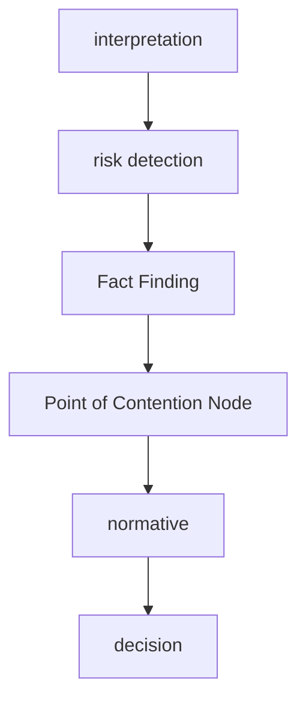

# Flow
1. Fact Finding Engine  
2. Risk Detection Engine
3. Issue
4. Normative Engine  
5. Conclusion

# 法律推論パイプライン  

## Step1 事実認定  
[[Fact Finding Engine]]    
## Step2 リスク検知
[[Risk Detection Engine]]
## Step3 争点ノード
[[争点ノード]]
## Step4 規範適用  
[[Normative Engine]]    
## Step5 結論  
- 適法
- 違法
- 不明

## フロー

