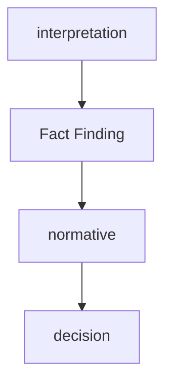

# Flow
1. Fact Finding Engine  
2. Normative Engine  
3. Conclusion

# 法律推論パイプライン  
  
## Step1 事実認定  
[[Fact Finding Engine]]    
## Step2 規範適用  
[[Normative Engine]]    
## Step3 結論  
- 適法
- 違法
- 不明

