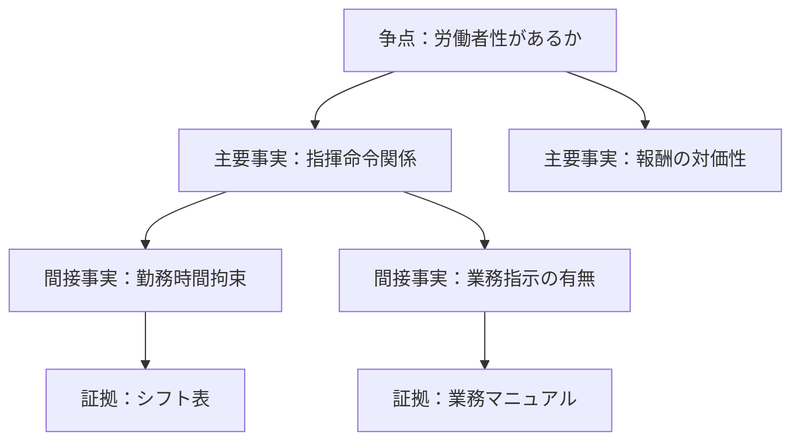

---
id:
title: 労働者性があるか

concept_type: [issue]

relations:
- type: requires
  to: 指揮命令関係がある 報酬が労務対価である

tags: [労働法]
status: draft
---
;
# Summary
当該人物が労働者に該当するか

# Legal Question
YESなら労働法適用、NOなら適用外

# Required Facts
- [[指揮命令関係がある]]
- [[報酬が労務対価である]]

# Status
未確定

# overall

# Issue
[[02_zettelkasten/21_domain/lawvault/issue/労働者性/労働者性があるか]]

# Fact
- [[02_zettelkasten/21_domain/lawvault/issue/労働者性/fact/指揮命令関係]]
- [[02_zettelkasten/21_domain/lawvault/issue/労働者性/fact/報酬の対価性]]