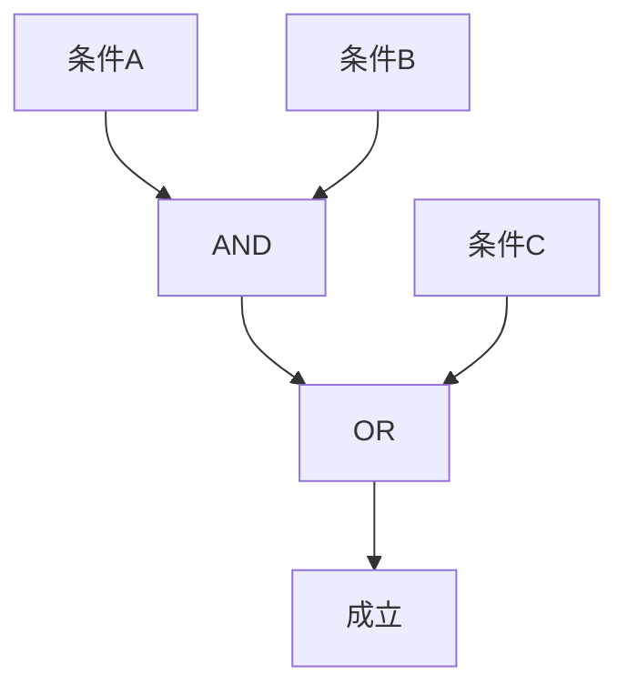

# Summary
安全運行の責任者

---

# 要件
- 資格者配置
- 車両数に応じた人数

---

# 根拠
運行管理者の配置義務 1

```mermaid
flowchart TD

    AND1["AND"]
    OR1["OR"]

    A[条件A]
    B[条件B]
    C[条件C]

    %% AND部分
    A --> AND1
    B --> AND1

    %% OR部分
    AND1 --> OR1
    C --> OR1

    %% 結論
    OR1 --> RESULT[成立]
```
