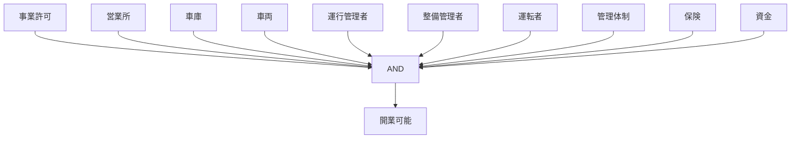

# Summary
一般乗用旅客自動車運送事業（ハイタク）の開業に必要な必須条件

---

# Inference（機械可読）

IF:
- all_of（must_haveと同一）

THEN:
- 開業可能

ELSE:
- 開業不可（違法）

---

# Interpretation（人間向け）

- 1つでも欠けると営業開始不可
- 「緑ナンバー」は含まれない（結果であり要件ではない）
- 許可が最上位条件

---

# Mermaid（自動生成 or 手動）

---

# Links
[[ISS_ハイタク事業として適法か]]
[[TRG_旅客運送]]