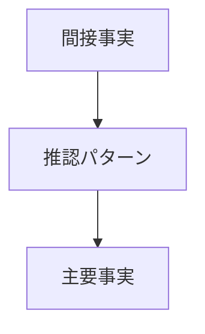

# 推認パターン辞書

## Summary
間接事実から主要事実を導く推論ルール集

---

## パターン一覧

- [[指揮命令推認]]
- [[故意推認]]
- [[契約成立推認]]
- [[過失推認]]
- [[因果関係推認]]

---

## 使用方法

1. 間接事実を抽出
2. 該当パターンを検索
3. 推認を適用
4. 主要事実を生成

---

# Engine との接続

---

# Vaultでの動き

Issue
↓
Fact（間接）
↓
Inference Pattern ←ここで辞書使用
↓
Fact（主要）
↓
Normative

---
## Links
- [[Fact Finding Engine]]