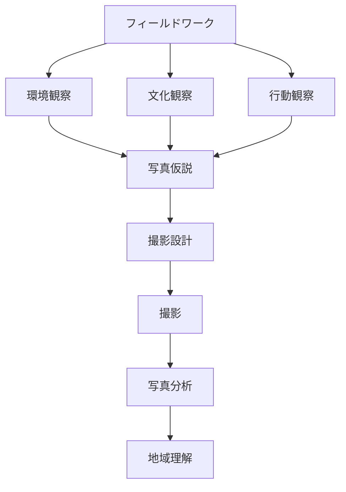

# Photo Fieldwork OS

Photo Fieldwork OS は

**写真 + フィールドワーク + 観光観察**

を統合した観察システムである。

写真を

**観察記録ツール**

として使用する。

---

# 全体構造

---

# ノート一覧

- [[02_zettelkasten/21_domain/photography/photo_fieldwork/フィールドワーク観察]]
- [[環境観察]]
- [[文化観察]]
- [[行動観察]]
- [[02_zettelkasten/21_domain/photography/photo_fieldwork/写真仮説|写真仮説]]
- [[撮影設計]]
- [[フィールド撮影]]
- [[写真分析]]