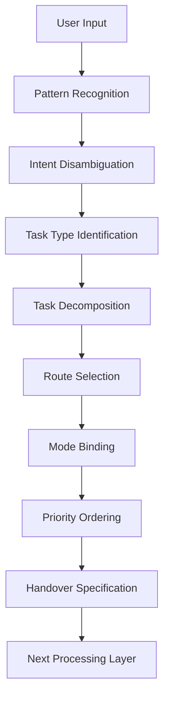
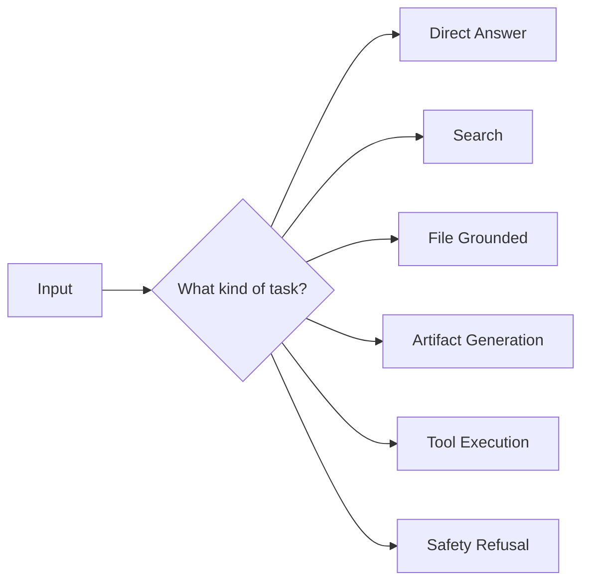

# Task Routing

Task Routing は、入力された依頼や質問を、**適切な処理系・推論モード・ツールチェーン・出力モードへ振り分ける構造**である。  
その核心は、表面上の文を読むことではなく、**この依頼は実際にはどの仕事なのか**を見抜き、最も合った処理ラインへ送ることにある。

---

# 要点

- 同じ自然言語でも、実際のタスク型は異なる
- Task Routing は「何を答えるか」より前に、「何として扱うか」を決める
- ルーティングを誤ると、以後の推論・検索・出力がすべてずれる
- 一つの入力に複数タスクが含まれる場合、分解して別ルートへ流す必要がある
- 良いルーティングは、過不足のない処理深度と適切な成果物形式を生む

---

# なぜ必要か

自然言語の依頼は曖昧であり、同じ表現でも意図は大きく異なる。

例:
- 「これを見てください」
  - 要約なのか
  - 評価なのか
  - 誤り検出なのか
  - 書き直しなのか

- 「作ってください」
  - 説明文作成なのか
  - ノート生成なのか
  - コード作成なのか
  - スプレッドシート作成なのか

- 「どう思いますか」
  - 感想要求なのか
  - 論理評価なのか
  - 妥当性判定なのか
  - 改善提案なのか

この曖昧性を解消しないまま進むと、回答の方向がずれる。  
Task Routing は、このずれを防ぐための最初の振り分け機構である。

---

# 中核機能

## 1. Task Type Identification
入力がどの種類のタスクかを特定する。

代表類型:
- 質問応答
- 説明
- 要約
- 分析
- 比較
- 評価
- 生成
- 編集
- 検索
- 実行
- 計画
- 変換
- 拒否判定付き依頼

この識別は、表面語だけでなく、要求成果物・必要根拠・操作対象を見て行う。

---

## 2. Intent Disambiguation
曖昧な表現の背後にある実意図を絞る。

見るべきもの:
- 依頼動詞
- 添付物の有無
- 指定形式
- ドメイン
- 直前会話文脈
- ユーザーの作業段階
- 出力の期待粒度

たとえば「続きを作ってください」は、
- 前ノートの続き
- 前回フォーマット踏襲
- 同一粒度維持
- 貼り付け可能形式

を含意する場合がある。

---

## 3. Task Decomposition
1つの依頼に複数タスクが混在している場合、それを分ける。

例:
- 「調べて比較して提案してください」
  - 検索
  - 比較
  - 推奨

- 「このPDFを要約して、その後表にしてください」
  - 読解
  - 要約
  - 構造化変換

Task Routing は、必要に応じて複合依頼をサブタスク列へ分割する。

---

## 4. Route Selection
識別したタスクを、どの処理ラインへ送るか決める。

代表ルート:
- Direct Answer Route
- Search Route
- File Grounded Route
- Tool Execution Route
- Artifact Generation Route
- Comparative Reasoning Route
- Safety Refusal Route

ここでの誤りは、その後の全工程に伝播する。

---

## 5. Mode Binding
ルートだけでなく、必要な処理モードを結びつける。

例:
- 比較 → 比較軸生成モード
- 要約 → 圧縮重視モード
- 設計 → 構造化生成モード
- 検証 → 根拠重視モード
- メール草案 → 文体調整モード

---

## 6. Priority Ordering
複数タスクがある時、何を先に処理するかを決める。

優先基準:
- 依頼の主目的
- 外部取得の必要性
- 制約確認の必要性
- 後続依存関係
- ユーザーがすぐ欲しい部分

---

## 7. Handover Specification
選んだルートに対し、何を持って引き渡すかを決める。

引継ぎ内容:
- タスク種別
- 成果物形式
- 使用言語
- 根拠要求
- 深さ
- 制約条件
- 優先順位
- 分解済みサブタスク列

これにより後段処理が安定する。

---

# タスク類型の代表マップ

## A. Informational Tasks
何かを知りたい、理解したいという依頼。

例:
- 説明
- 定義
- 背景整理
- 要約

## B. Analytical Tasks
構造・因果・比較・評価を行う依頼。

例:
- 分析
- 検証
- 妥当性判定
- 原因分析

## C. Generative Tasks
新しい成果物を作る依頼。

例:
- ノート
- 文書
- コード
- 表
- 設計案

## D. Action Tasks
外部ツールやシステムに働きかける依頼。

例:
- 送信
- 作成
- 更新
- 削除
- 予約

## E. Transform Tasks
形式や表現を変える依頼。

例:
- 書き換え
- 翻訳
- 表化
- Markdown化
- JSON化

---

# 下位構造

## A. Input Pattern Recognizer
依頼文のパターンを認識する部分。

## B. Intent Resolver
曖昧な要求を解釈し、主たる意図を決める部分。

## C. Task Splitter
複合依頼をサブタスクへ分解する部分。

## D. Route Binder
タスクと処理ラインを結びつける部分。

## E. Handover Builder
後段へ渡す処理仕様をまとめる部分。

---

# 全体構造

---

# ルーティング分岐の典型

---

# 典型例

|入力|Task Routing の判定|
|---|---|
|これを要約してください|要約タスク|
|これを比較してください|比較分析タスク|
|最新の状況を教えてください|外部検索タスク|
|この資料をもとに作ってください|ファイル根拠生成タスク|
|このメールに返信してください|メール読解 + 草案生成タスク|
|予定を入れてください|外部実行タスク|
|この形式でノートを作ってください|成果物生成タスク|

---

# よくある失敗

## 1. 表面語だけで判断する

「作ってください」を全部同じ生成タスクとして扱ってしまう。

## 2. 複合依頼を分解しない

検索・比較・提案が混ざっているのに一括処理して粗くなる。

## 3. 主目的を取り違える

補助要求を主タスクとして処理してしまう。

## 4. ルートは合っているがモードが違う

たとえば比較なのに説明モードで流してしまう。

## 5. 引継ぎ仕様が弱い

後段がタスクを再解釈し直す必要があり、ぶれが出る。

---

# 設計原則

- 最初にタスク型を見極める    
- 曖昧な依頼は成果物基準で解く    
- 複合依頼は必要に応じて分解する    
- 主目的を優先してルートを選ぶ    
- ルートだけでなく処理モードも束ねる    
- 後段に十分な引継ぎ情報を渡す    

---

# 位置づけ

Task Routing は、  
**自然言語依頼を実行可能な処理系へ変換する入口の分配機構**である。

これが弱いと、

- 検索すべきものを直答し    
- 作るべきものを説明し    
- 比較すべきものを要約し    
- 実行すべきものを助言で終える    

というずれが起こる。  
したがってこの構造は、単なる分類器ではなく、  
**LLM 実行全体の方向を最初に定める進路決定装置**である。

---

# 関連ノート

- [[LLM Control Layer]]    
- [[Tool Orchestration]]    
- [[Constraint Monitor]]    
- [[Termination Control]]    
- [[Intent Interpretation]]    
- [[LLM Output Layer]][[Intent Interpretation]]    
- [[LLM Output Layer]]