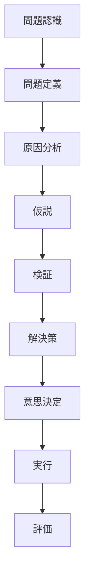

# Problem Structure
すべての思考はここから始まる。
Problem Structure は
問題発見
↓
問題定義
↓ 
原因分析 
↓ 
仮説 
↓ 
検証
↓ 
解決策
↓ 
意思決定

という **問題解決の基本プロセス**を扱う。

---

# 全体構造

# 基本概念

問題とは、目的 − 現状  =  ギャップのことである。

---

# 構造ノート

## 問題構造
[[問題構造]]
問題の基本定義。

---

## 問題定義構造
[[問題定義構造]]
問題の範囲と条件を明確化する。

---

## 原因分析構造
[[原因分析構造]]
問題の原因を特定する。

---

## 仮説構造
[[02_zettelkasten/Zettelkasten Engine/00_system/thinking_engine/02_inquiry/structure/problem/仮説構造]]
解決仮説を立てる。

---

## 検証構造
[[検証構造]]
仮説の正しさを検証する。

---

## 解決策構造
[[解決策構造]]
実際の施策を設計する。

---

## 意思決定構造
[[02_zettelkasten/Zettelkasten Engine/00_system/thinking_engine/02_inquiry/structure/problem/意思決定構造]]
複数の選択肢から最適を選ぶ。

---

# Argument Structure との関係
問題解決では Argument Structure が使われる。

問題  
↓  
仮説  
↓  
推論  
↓  
議論  
↓  
評価

# 関連
- [[推論構造]]    
- [[議論構造]]   
- [[論証評価構造]]