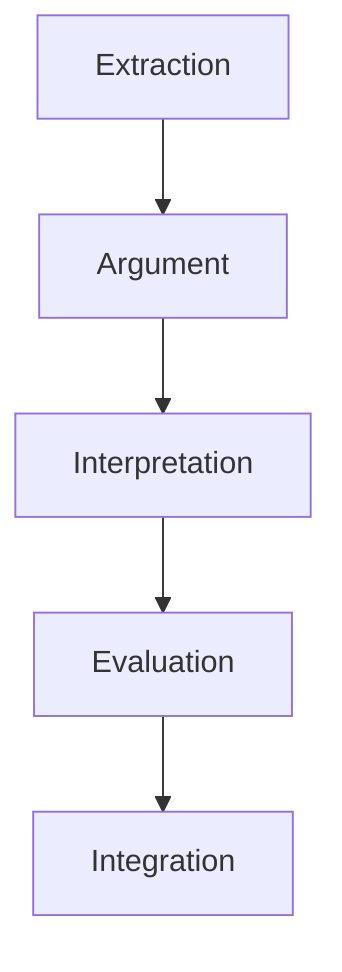
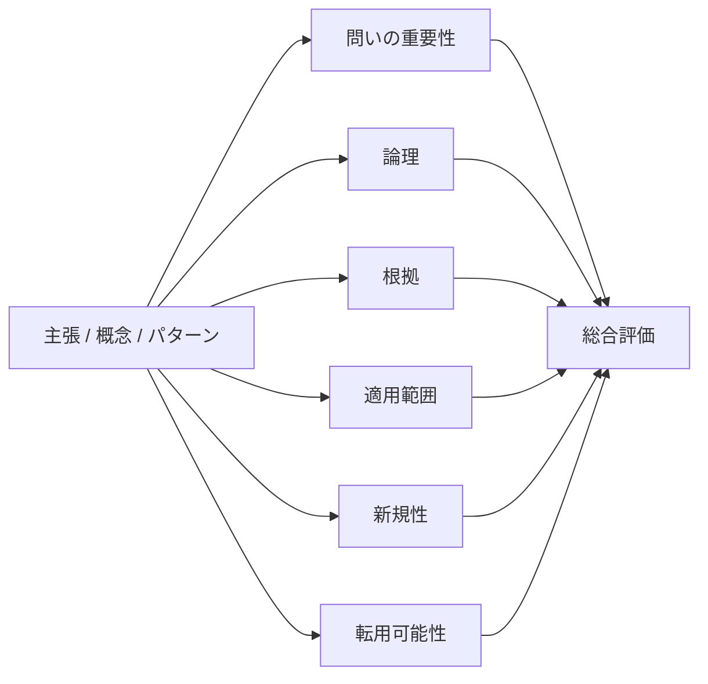
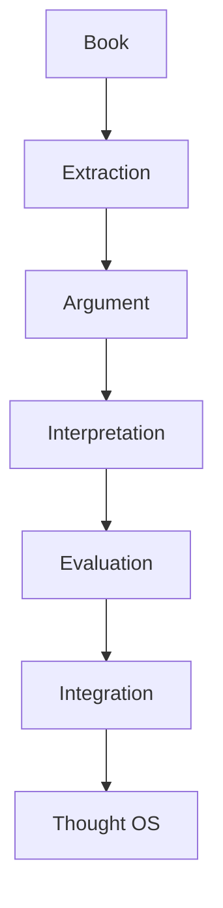

# Reading Evaluation Structure（読書評価構造）

読書によって得られた知識・議論・概念の価値を評価するための構造。
目的は次の3つ。
- 知識の信頼性を判断する  
- 知識の重要度を判断する  
- 知識の統合先を決める  

Evaluation は、Integration の前段階として働く。

---

# 読書OSにおける位置

Evaluation は、「理解した知識を統合する価値があるか判断する工程」である。

---

# 評価対象

評価の対象は次の5種類。

| 対象 | 内容 |
|---|---|
| 本 | 本全体 |
| 主張 | Claim |
| 概念 | Concept |
| パターン | Pattern |
| 証拠 | Evidence |

---

# 評価軸

評価は次の6軸で行う。

| 評価軸 | 内容 |
|---|---|
|問いの重要性 | 問題の深さ |
|論理 | 議論の整合性 |
|根拠 | Evidence の質 |
|適用範囲 | Scope |
|新規性 | Novelty |
|転用可能性 | Transferability |

---

# 評価構造

---

# 1 問いの重要性

扱っている問題の重要度。

| レベル | 内容 |
|---|---|
|低 | 局所問題 |
|中 | 分野内重要問題 |
|高 | 基本問題 |

例

高い問い

- 国家とは何か  
- 市場はどう機能するか  
- 組織はなぜ硬直化するか  

---

# 2 論理

議論の整合性。

評価ポイント

- 結論が明確か  
- 論理の飛躍がないか  
- 前提が明示されているか  
- 反論に対応しているか  

弱い議論の例

- 事例だけで一般化
- 結論だけ強い
- 前提が隠れている

---

# 3 根拠

Evidence の質。

| 根拠 | 信頼度 |
|---|---|
|逸話 | 低 |
|単一事例 | 中 |
|複数事例 | 中〜高 |
|統計 | 高 |
|複数独立証拠 | 非常に高 |

---

# 4 適用範囲

議論が成立する範囲。

| Scope | 内容 |
|---|---|
|狭い | 特定事例 |
|中 | 特定分野 |
|広い | 一般理論 |

注意

適用範囲が広いほど良いとは限らない。

---

# 5 新規性

視点の新しさ。

| レベル | 内容 |
|---|---|
|低 | 既存理論の反復 |
|中 | 整理・改良 |
|高 | 新しい視点 |

---

# 6 転用可能性

他分野で使えるか。

| レベル | 内容 |
|---|---|
|低 | 特定事例 |
|中 | 同分野 |
|高 | 多分野 |

転用可能性が高い知識は  
**Kernel候補**になりやすい。

---

# 総合評価

評価結果は次の4段階で分類する。

| レベル | 意味 |
|---|---|
|A | 核心知識 |
|B | 重要知識 |
|C | 参考知識 |
|D | 保留 |

---

# 統合ルール

評価結果により統合先を決める。

| 評価 | 統合先 |
|---|---|
|A | Kernel / World Model |
|B | Domain |
|C | Reference |
|D | Question |

---

# 評価例

主張

「官僚制は効率と硬直を同時に生む」

評価

| 評価軸 | 判定 |
|---|---|
|問い | 高 |
|論理 | 高 |
|根拠 | 中 |
|範囲 | 中 |
|新規性 | 中 |
|転用 | 高 |

結果

重要度：A  

統合先：Kernel

---

# 知識の弱点検出

Evaluation は次の問題を見抜く。

| 問題 | 内容 |
|---|---|
|過度一般化 | Overgeneralization |
|相関誤認 | Correlation error |
|逸話依存 | Anecdotal bias |
|隠れ前提 | Hidden assumption |
|概念不明確 | Undefined concept |

---

# 良い本の特徴

良書は次を満たす。

- 問いが深い  
- 論理が明確  
- 根拠が適切  
- 概念が明確  
- 適用範囲が示される  

---

# 読書OSにおける役割

Evaluation によって、知識の品質管理が可能になる。