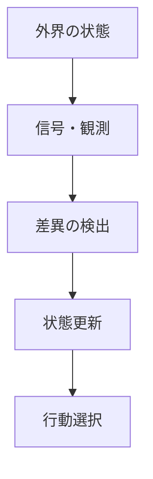

# 情報

## 定義

ある主体またはシステムにとって、  
**不確実性を減らし、状態認識や行動選択を変化させる差異**

を **情報** という。

簡単に言えば、

**情報とは、何かを変える差異である。**

---

## 要点

情報は単なるデータではない。

本質は

- 状態を区別できること
- 不確実性を減らすこと
- 予測や制御に使えること
- 行動を変えうること

にある。

したがって、

同じデータでも  
主体や文脈が違えば情報量は変わる。

---

# 基本構造



---

# 情報の本質

## 1 差異である

情報とは  
「区別がつくこと」である。

例

- 温度が高い / 低い
- 敵がいる / いない
- 売れる / 売れない

差がなければ情報はない。

---

## 2 不確実性を減らす

情報は、分からなかった状態を  
より分かる状態へ変える。

例

- 地図を見ると道が分かる
- 計器を見ると状態が分かる
- 財務資料を見ると経営状態が分かる

---

## 3 制御に使われる

情報は受け取るだけでは終わらない。

- 修正
- 回避
- 選択
- 調整

に使われて初めて意味を持つ。

---

## 4 文脈依存である

同じ信号でも  
誰にとっても同じ情報とは限らない。

例

- 専門家には重要
- 素人には無意味

つまり情報は  
主体・目的・文脈に依存する。

---

# 情報とデータの違い

|概念|意味|
|---|---|
|データ|記録された値や記号|
|情報|差異として意味を持つもの|
|知識|情報が構造化されたもの|

したがって

```text
データ → 情報 → 知識
```

という流れがある。

---

# 情報が必要になる理由

## 1 未来は不確実だから

システムは常に不完全情報の中で動く。

そのため

- 観測
- 推定
- 更新

が必要になる。

---

## 2 制御には状態把握が必要だから

制御は

```text
現状把握
↓
目標との差分認識
↓
修正
```

で成り立つ。

この最初の条件が情報である。

---

## 3 選択には比較が必要だから

どの選択肢が良いかは  
情報なしには判断できない。

---

# [[02_zettelkasten/Zettelkasten Engine/01_knowledge/world_model/kernel/physics/相互作用原理]]との関係

情報は孤立して存在するものではなく、  
相互作用の中で生成・伝達・利用される。

```text
相互作用
↓
信号
↓
解釈
↓
状態更新
```

したがって情報は  
**相互作用の痕跡であり、媒介でもある。**

---

# [[フィードバック]]との関係

フィードバックは  
結果が再び入力へ戻る構造である。

そのとき戻ってくるものは  
本質的には **情報** である。

例

- 温度センサーの計測値
- 売上報告
- 痛みの感覚

つまりフィードバックは  
**情報循環の一形態**でもある。

---

# [[探索]]との関係

探索は  
未知の空間から情報を得る行為である。

```text
探索
↓
情報獲得
↓
状態更新
↓
行動改善
```

したがって探索原理は  
情報原理の動的運用形と見なせる。

---

# [[02_zettelkasten/Zettelkasten Engine/01_knowledge/world_model/concept/選択]]との関係

選択は  
情報を用いて複数の可能性から一つを決める過程である。

情報が不十分なら

- 誤選択
- 過剰適応
- 手探り

が起きる。

---

# [[02_zettelkasten/Zettelkasten Engine/01_knowledge/world_model/concept/制約]]との関係

情報には常に制約がある。

- 観測できない
- ノイズがある
- 処理能力が足りない
- 時間が足りない

したがって現実の意思決定は  
**完全情報ではなく制約付き情報処理**である。

---

# [[02_zettelkasten/Zettelkasten Engine/01_knowledge/world_model/kernel/system/スケール原理]]との関係

スケールが変わると  
必要な情報の量・粒度・更新頻度が変わる。

例

- 個人の行動判断
- 組織の経営管理
- 国家の政策運営

では必要な情報構造が異なる。

大規模になるほど

- 要約
- 指標化
- レポート化
- モデル化

が必要になる。

---

# 各領域での例

## 生物

- 神経信号
- 感覚入力
- 遺伝情報

---

## 社会

- ニュース
- 評判
- 価格
- 制度通知

---

## 経済

- 市場価格
- 財務情報
- 需要予測

---

## 技術

- センサーデータ
- 通信信号
- ログ
- アラート

---

## 組織

- 報告
- KPI
- 顧客の声
- 現場記録

---

# mechanism

情報と接続しやすいメカニズム

- 情報更新メカニズム
- シグナリングメカニズム
- 情報非対称メカニズム
- 評判メカニズム
- フィードバック制御メカニズム

---

# pattern

情報から現れやすいパターン

- 情報カスケード
- デマ拡散
- シグナル依存
- 認知の偏り
- 情報独占
- 情報分断

---

# case

- 株価の価格情報
- 地図アプリの経路情報
- SNSでの拡散
- レーダー警報
- 売上ダッシュボード

---

# 見分けるための問い

- この差異は何を区別させているか
- 何の不確実性を減らしているか
- 誰にとって情報なのか
- 行動や判断を変える力があるか
- どの制約の下で処理されているか

---

# 要約

情報とは、

**不確実性を減らし、状態認識や行動選択を変える差異**

である。

したがって、対象を理解するには  
モノそのものだけでなく、

**何が情報として観測され、どう処理され、どう行動に結びつくか**

を見なければならない。