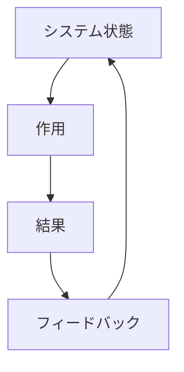
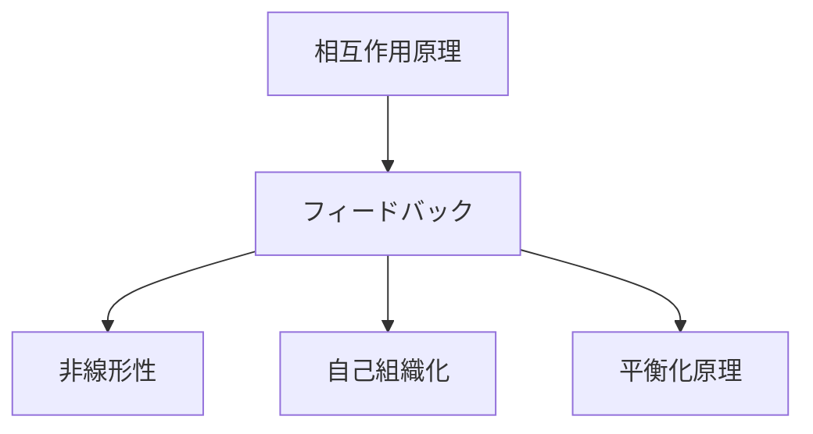

---
type: kernel
kernel_domain: system

is_a:
 - 相互作用原理

explains:
 - システム安定化
 - システム増幅
 - 制御
 - 自己調整
 - 循環因果

causes:
 - システム制御
 - 動的均衡
 - 振動
 - カオス

related_to:
 - 正のフィードバック
 - 負のフィードバック
 - 非線形性
 - 自己組織化
 - 平衡化原理

level: principle
status: canonical
---

# フィードバック

## 定義

システムの出力が再び入力として戻り、  
**システムの状態を変化させる循環的因果関係**

を

**フィードバック（Feedback）**

という。

フィードバックは

- 自然
- 生物
- 社会
- 経済
- 技術

など多くのシステムで見られる基本原理である。

---

# 基本構造



---

# フィードバックの種類

## 正のフィードバック

変化を **増幅する**

例

- 人口爆発
- バブル
- 口コミ拡散

---

## 負のフィードバック

変化を **抑制する**

例

- 体温調節
- 市場価格調整
- 自動制御

---

# Kernelとの関係



---

# なぜフィードバックが重要か

多くのシステムは

**直線的因果**

ではなく

**循環因果**

で動く。

```
原因
↓
結果
↓
結果が原因を変える
```

---

# フィードバックの役割

## 安定化

負のフィードバックにより  
システムは安定する。

例

- 生体恒常性
- 自動温度制御

---

## 増幅

正のフィードバックにより  
変化が急速に拡大する。

例

- 技術普及
- SNS拡散

---

## 振動

フィードバックが遅延すると  
周期運動が生まれる。

例

- 景気循環
- 生態系周期

---

# 他分野での例

## 生物

- ホルモン調節
- 体温維持

---

## 経済

- 価格調整
- 投機バブル

---

## 社会

- 評判拡散
- 流行

---

## 技術

- サーモスタット
- 自動操縦

---

# mechanism

フィードバックから生まれるメカニズム

- 制御メカニズム
- 調整メカニズム
- 拡散メカニズム
- 増幅メカニズム

---

# pattern

フィードバックから現れるパターン

- バブル形成
- 流行拡散
- 安定平衡
- 振動

---

# case

- 株価バブル  
- SNSバズ  
- 捕食者‐被食者周期  
- 自動温度制御

---

# 見分けるための問い

- 出力が再び原因に戻っているか  
- 変化は増幅しているか抑制しているか  
- システムは循環構造を持っているか  
- 遅延が存在するか  

---

# 要約

フィードバックとは

**結果が原因に戻る循環因果**

である。

多くのシステムは

- 増幅（正フィードバック）
- 安定化（負フィードバック）

によって動いている。