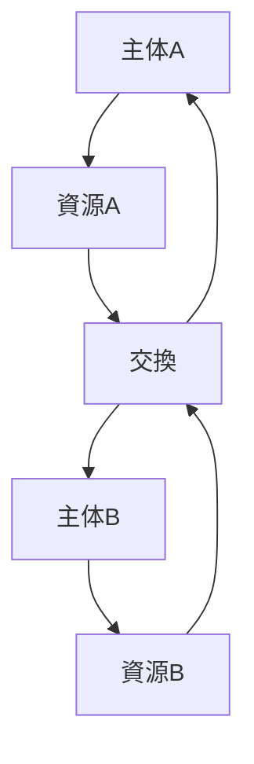
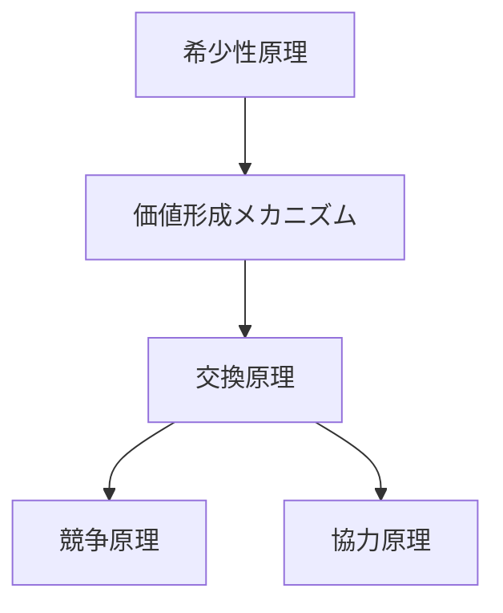

# 交換原理

## 定義

主体が互いに資源を交換することで  
双方の効用が増加するという原理を

**交換原理（Exchange Principle）**

という。

交換は

- 経済
- 社会
- 生物
- 情報

など多くのシステムで現れる。

---

# 基本構造



---

# 交換が成立する条件

交換には次の条件が必要である。

### 1 価値差

主体ごとに価値評価が異なる。

例

```
Aはリンゴを多く持つ
Bは魚を多く持つ
```

---

### 2 希少性

資源は有限である。

---

### 3 交換可能性

資源が移転できる。

---

### 4 信頼または制度

交換が破綻しない保証。

例

- 契約
- 法律
- 信用
- 評判

---

# Kernel関係

交換原理は以下の原理と結びつく。



---

# 交換と分業

交換は分業を可能にする。

```
分業
↓
生産効率上昇
↓
交換
↓
市場
```

例

- 農業
- 工業
- サービス

---

# 交換の種類

## 物々交換

直接交換

---

## 市場交換

貨幣を介した交換

---

## 社会交換

贈与・互恵

---

## 情報交換

知識・データ

---

# Pattern

交換原理から次のパターンが生まれる。

- [[市場競争]]
- [[交易ネットワーク]]
- [[贈与関係]]
- [[協力行動]]

---

# Case

例

- シルクロード交易
- 株式市場
- フリーマーケット
- データ取引

---

# 要約

交換原理とは

```
価値差
＋
希少性
＋
相互利益
```

によって

主体間で資源が移動する現象である。

交換は

**市場・経済・社会構造の基礎となる原理である。**