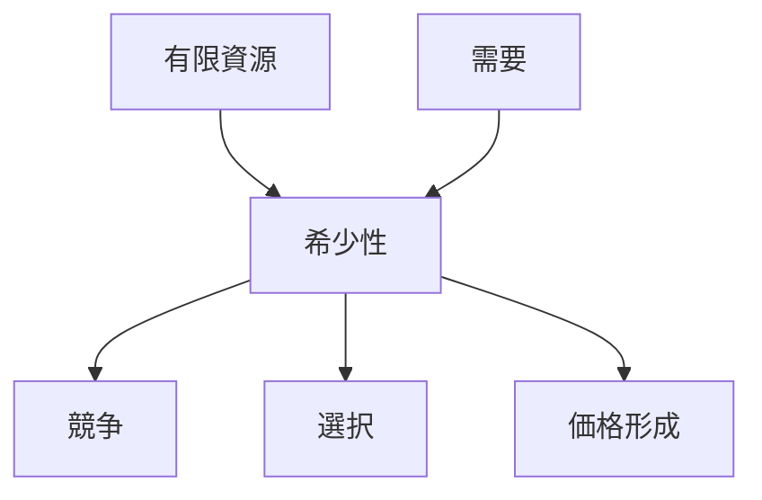
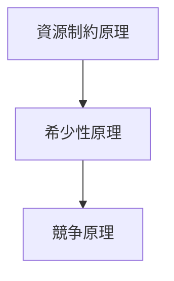
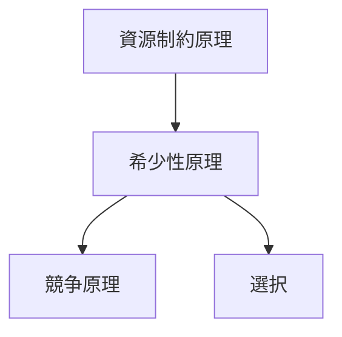

# 希少性原理

## 定義

**資源が有限で需要が無限に近いとき、  
主体は資源の配分・選択・競争を行う。**

これを **希少性原理（Scarcity Principle）** という。

---

# 基本構造



---

# 原理の内容

希少性があると以下が発生する。

1  
**選択**

すべては得られないため  
主体は選択する。

---

2  
**競争**

同じ資源を複数主体が求める。

---

3  
**交換**

資源は交換可能になる。

---

4  
**価値**

希少なものは価値を持つ。

---

# 資源制約原理との関係

希少性原理は

```
資源制約原理
↓
希少性原理
↓
競争原理
```

という関係にある。

---

# 構造図



---

# 適用領域

希少性原理は多くの分野で現れる。

## 経済

- 市場価格
- 資源配分
- 労働市場

---

## 生物

- 生存競争
- 食物資源

---

## 情報

- 注意資源
- 時間資源

---

## 社会

- 地位
- 権力
- 人気

---

# 典型的パターン

希少性があると次のパターンが生まれる。

- 競争
- 排除
- 市場形成
- 独占
- 協力

---

# mechanism

希少性原理は以下のメカニズムを生む。

- [[競争メカニズム]]
- [[価格形成メカニズム]]
- [[選択メカニズム]]

---

# pattern

典型的パターン

- [[02_zettelkasten/Zettelkasten Engine/01_knowledge/world_model/pattern/market/市場競争パターン]]
- [[独占形成パターン]]
- [[資源争奪パターン]]

---

# case

- 石油市場
- 土地価格
- 就職市場
- 食物連鎖

---

# Kernel Graph

希少性原理の位置



---

# 要約

希少性とは

**有限資源 × 需要**

であり、

その結果

- 選択
- 競争
- 価値

が生まれる。

これは

**経済・生物・社会すべてに共通する普遍原理**

である。
