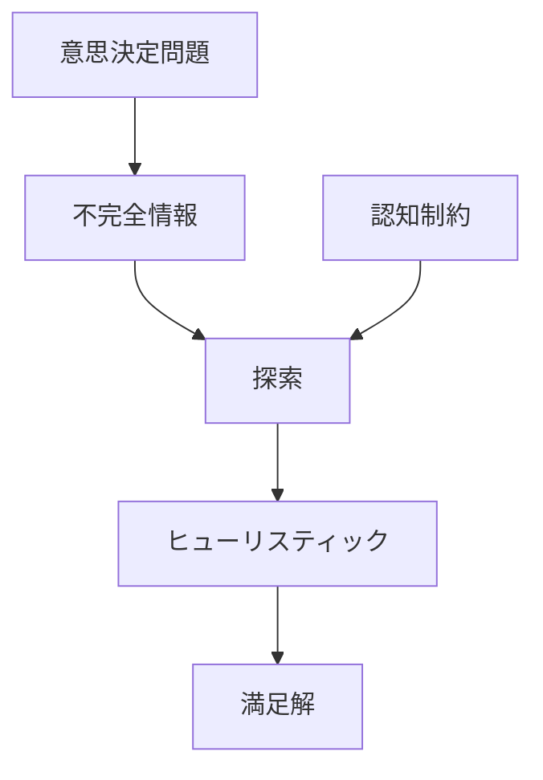
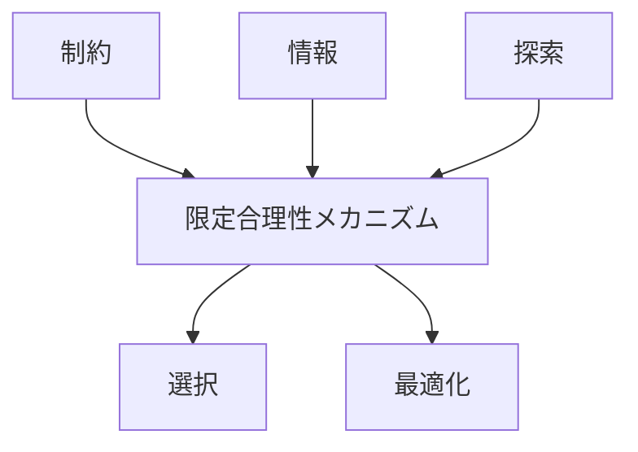

# 限定合理性メカニズム

## 定義

主体が

- 情報不足
- 認知能力の限界
- 時間制約
- 計算コスト

などの制約の下で

**完全な最適解ではなく、十分に良い解を選ぶ意思決定の仕組み**

を **限定合理性メカニズム（Bounded Rationality Mechanism）** という。

---

# 基本構造



つまり

```text
不完全情報
+
認知制約
↓
近似判断
↓
満足解
```

である。

---

# 限定合理性の本質

## 1 完全合理性は現実では不可能

理論上の合理性は

```
すべての選択肢
すべての結果
完全情報
無限計算
```

を前提とする。

しかし現実では

- 情報不足
- 計算能力不足
- 時間不足

がある。

---

## 2 人間は近似判断を使う

主体は複雑な問題を解くとき

- ルール
- 直感
- 簡略化

を使う。

これが **ヒューリスティック** である。

---

## 3 満足化（Satisficing）

主体は

```
最適解
```

ではなく

```
十分良い解
```

を選ぶ。

---

# kernelとの関係



---

# 認知制約との関係

限定合理性は

```
認知制約
```

から生まれる。

例

- 注意資源
- 記憶容量
- 計算能力

---

# 探索との関係

探索は理想的には

```
全探索
```

が必要だが、

限定合理性の下では

```
部分探索
```

になる。

---

# 最適化との関係

限定合理性では

```
最適化
↓
困難
```

なので

```
近似最適
```

を選ぶ。

---

# 各領域での例

## 個人意思決定

- 商品選択
- 投資判断
- 進路決定

---

## 経済

- 企業戦略
- 価格設定
- 市場行動

---

## 組織

- 業務判断
- 予算配分
- 人事決定

---

## 技術

- ヒューリスティックアルゴリズム
- 近似計算
- 探索アルゴリズム

---

# pattern

限定合理性から現れやすいパターン

- 近道判断
- 確証バイアス
- 局所最適
- 慣性行動

---

# case

- スーパーでの直感購入
- 投資家の経験則判断
- 企業の段階的戦略変更
- 管理職の迅速判断

---

# 見分けるための問い

- 情報は十分か
- 計算可能か
- 判断時間はあるか
- どのヒューリスティックを使っているか
- 満足解で止まっているか

---

# 要約

限定合理性メカニズムとは

**情報・認知・時間の制約の下で、主体が近似的な判断を行い、十分に良い解を選ぶ意思決定の仕組み**

である。

したがって現実の意思決定は  
理論的最適化ではなく

**制約付き合理性**

として理解する必要がある。