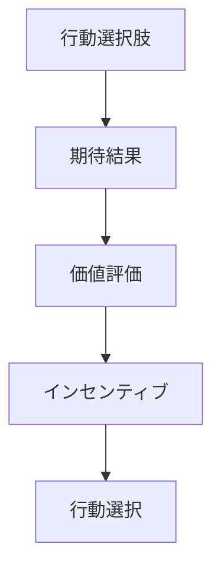
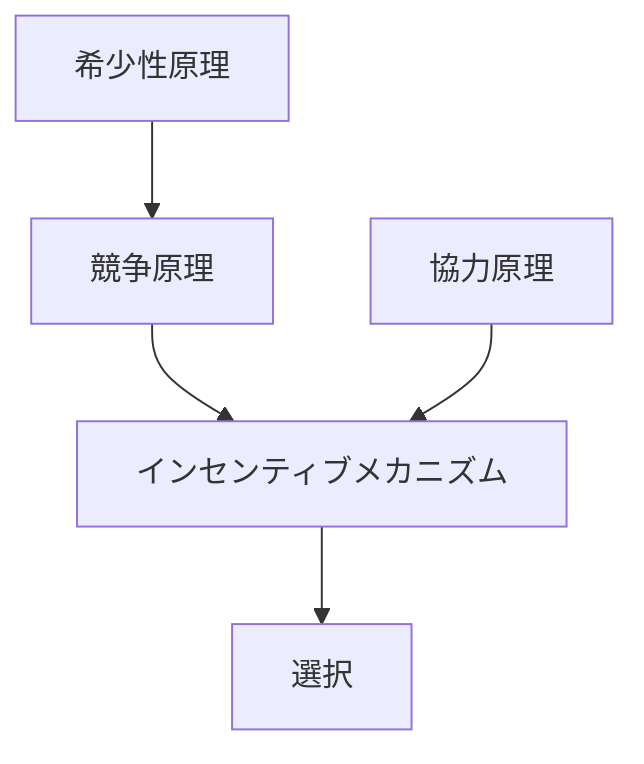

# インセンティブメカニズム

## 定義

主体がある行動を選ぶとき、

- 報酬
- 罰
- 利益
- 損失

などの **期待される結果** が  
行動選択に影響を与える仕組みを

**インセンティブメカニズム（Incentive Mechanism）**という。

---

# 基本構造



つまり

```
行動
↓
結果予想
↓
価値評価
↓
行動選択
```

である。

---

# インセンティブの種類

## 正のインセンティブ

行動すると利益が得られる。

例

- ボーナス
- 評価
- 利益

結果

```
行動促進
```

---

## 負のインセンティブ

行動しないと不利益が生じる。

例

- 罰金
- 減給
- ペナルティ

結果

```
行動誘導
```

---

## 内発的インセンティブ

主体の内面から生まれる動機。

例

- 好奇心
- 達成感
- 社会的承認

---

## 外発的インセンティブ

外部から与えられる報酬。

例

- 金銭
- 評価
- 地位

---

# kernelとの関係



---

# 強化との関係

インセンティブは

```
行動前
```

に作用する。

強化は

```
行動後
```

に作用する。

---

# 資源制約との関係

資源が有限であるため

```
利益
```

をめぐる行動誘導が生まれる。

---

# 経済での例

- 価格シグナル
- 税制
- 補助金
- インセンティブ契約

---

# 組織での例

- KPI
- ボーナス制度
- 評価制度
- 昇進制度

---

# 社会での例

- 罰則
- 社会評価
- 名誉
- reputational incentive

---

# pattern

インセンティブメカニズムから現れるパターン

- モラルハザード
- 逆インセンティブ
- 努力誘導
- 戦略行動

---

# case

- 営業インセンティブ
- 成果報酬契約
- 炭素税
- 補助金政策

---

# 見分けるための問い

- どの行動が報酬を生むか
- 不利益は何か
- 主体は何を最大化しようとしているか
- インセンティブは意図通り機能しているか
- 逆インセンティブは起きていないか

---

# 要約

インセンティブメカニズムとは

**行動の結果として得られる利益や損失の期待が、主体の行動選択を誘導する仕組み**

であり、

```
結果期待
↓
価値評価
↓
行動誘導
```

という形で  
経済・組織・社会の多くの行動を説明する。