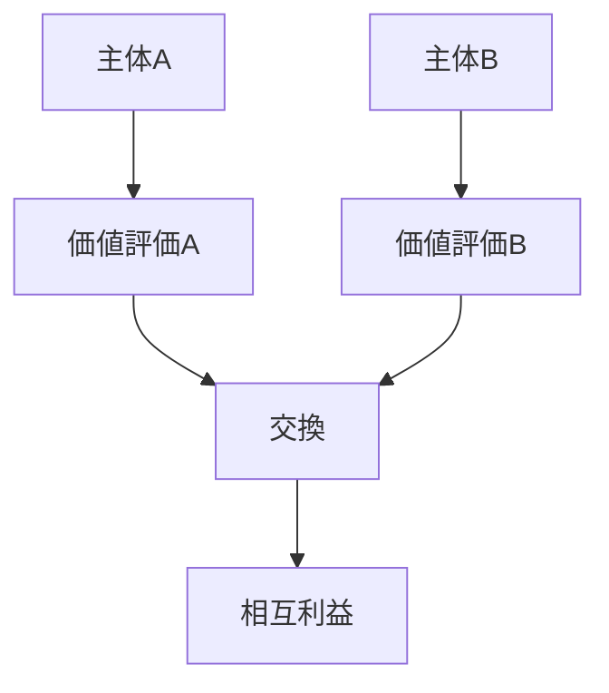
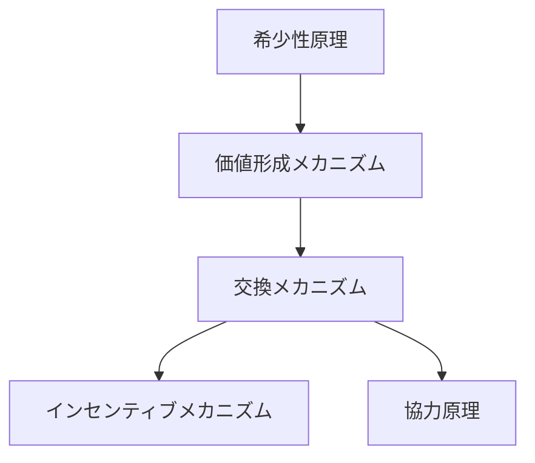

# 交換メカニズム

## 定義

主体同士が

- 資源
- 商品
- サービス
- 情報

を互いに提供し、

**双方が価値を得る形で資源を移動させる仕組み**

を **交換メカニズム** という。

---

# 基本構造



つまり

```
価値評価
↓
交換
↓
相互利益
```

である。

---

# 交換成立の条件

交換は次の条件が満たされると成立する。

## 1 価値の差

主体Aと主体Bで

```
価値評価
```

が異なる。

例

- Aは水を多く持つ
- Bは食料を多く持つ

---

## 2 相互利益

交換すると

```
双方の利益
```

が増える。

---

## 3 信頼

裏切りが起こらないという期待。

---

## 4 所有権

交換できる対象が

```
主体の所有
```

である。

---

# kernelとの関係



---

# 価値形成との関係

価値評価がなければ

```
交換
```

は成立しない。

---

# 信頼との関係

信頼がないと

```
交換コスト
```

が高くなる。

例

- 契約
- 仲介

---

# 協力との関係

交換は

```
協力の基本形
```

である。

---

# 競争との関係

市場では

```
複数主体
```

が交換相手を巡って競争する。

---

# 各領域での例

## 経済

- 市場取引
- 貿易
- 労働契約

---

## 社会

- 贈与
- 相互扶助
- ネットワーク交換

---

## 組織

- 業務分担
- 情報交換

---

## デジタル

- プラットフォーム取引
- データ交換

---

# pattern

交換メカニズムから現れるパターン

- 市場
- 分業
- 貿易ネットワーク
- 価格形成

---

# case

- 市場売買
- 国際貿易
- 労働契約
- SNSフォロー交換

---

# 見分けるための問い

- 誰と誰が交換しているか
- 何を交換しているか
- 双方の価値評価は何か
- 交換による利益は何か
- 信頼はどのように保証されているか

---

# 要約

交換メカニズムとは

**主体間で資源や価値を交換し、相互利益を生み出す仕組み**

であり、

```
価値評価
↓
交換
↓
利益
```

という過程を通じて  
市場・協力・分業などの社会システムを形成する。