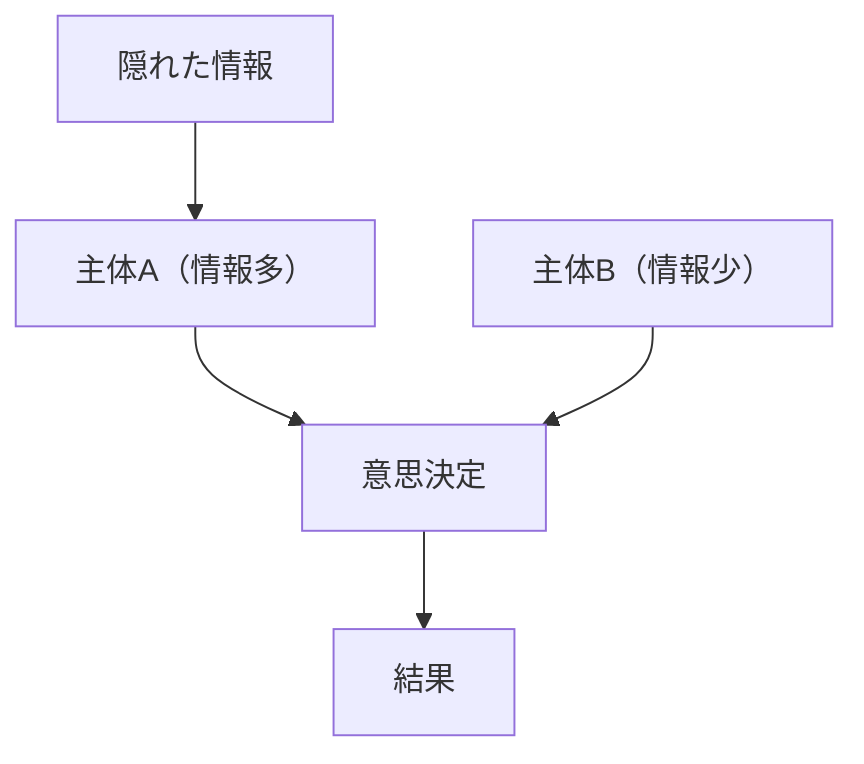
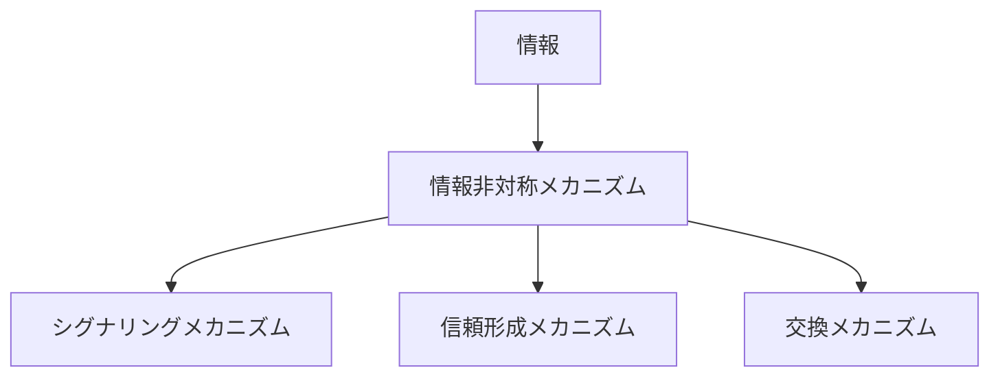

# 情報非対称メカニズム

## 定義

取引や相互作用において

- ある主体が他の主体より多くの情報を持つ
- 重要な情報が相手から見えない

という **情報格差** が存在し、  
それが行動・取引・制度に影響を与える仕組みを

**情報非対称メカニズム** という。

---

# 基本構造



つまり

```text
情報格差
↓
不完全判断
↓
行動歪み
```

である。

---

# 情報非対称の本質

## 1 見えない品質

取引の対象が

```
事前に完全に観察できない
```

場合に発生する。

例

- 商品品質
- 労働能力
- 契約履行意図

---

## 2 意図の不透明性

主体の

```
本当の意図
```

が観察できない。

例

- 保険契約
- 政治行動
- 投資判断

---

## 3 行動の不可視性

行動が完全に監視できない。

例

- 労働努力
- 経営判断
- 契約履行

---

# kernelとの関係



---

# シグナリングとの関係

情報非対称があると  
主体は自分の品質を示すために

```
シグナル
```

を出す。

例

- 学位
- ブランド
- 保証

---

# 評判との関係

評判は

```
過去の情報
```

を蓄積することで  
情報非対称を緩和する。

---

# 信頼との関係

信頼は

```
情報不足
```

を補う手段である。

---

# インセンティブとの関係

契約や制度は

```
情報非対称
```

による不正を防ぐために設計される。

---

# 情報非対称が生む典型問題

## 逆選択

品質が事前に分からないと

```
低品質が残る
```

例

- 中古車市場

---

## モラルハザード

契約後に

```
隠れた行動
```

が変わる。

例

- 保険加入後のリスク行動

---

# 各領域での例

## 労働市場

- 採用時の能力不明
- 履歴書

---

## 保険市場

- 健康状態
- リスク行動

---

## 金融

- 企業情報
- 投資判断

---

## デジタル

- レビュー
- 評価システム

---

# pattern

情報非対称メカニズムから現れるパターン

- 逆選択
- モラルハザード
- 情報操作
- 市場失敗

---

# case

- 中古車市場
- 保険契約
- 採用面接
- 投資市場

---

# 見分けるための問い

- 誰がどの情報を持っているか
- 相手は何を知らないか
- その情報格差はどんな行動を生むか
- 情報格差をどう補っているか
- 制度やシグナルはあるか

---

# 要約

情報非対称メカニズムとは

**主体間で情報の保有量が異なることによって、判断や取引の結果が歪む仕組み**

であり、

```text
情報格差
↓
不完全判断
↓
行動歪み
```

という過程を通じて  
市場失敗や制度形成を引き起こす。