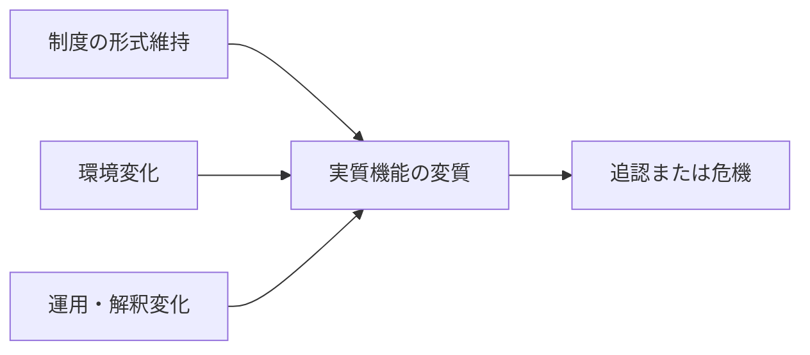

# Institutional Drift Mechanism

Institutional Drift Mechanism（制度ドリフトメカニズム）とは、制度の明文や形式は大きく変わらないまま、環境変化、運用変化、解釈変化によって、実質的な機能や意味が徐々に変質していく仕組みである。

---

# 概要

制度は変わっていないように見えても、社会や技術や運用主体が変われば、実際の働き方は変わる。  
この変化はしばしば急進的改革より目立たないが、長期的には大きい。  
制度ドリフトは、放置、解釈のずれ、執行強度の変化、対象環境の変質によって進む。

制度ドリフトメカニズムの核心は、

1. 制度形式の維持
2. 環境変化
3. 運用・解釈のズレ
4. 実質機能の変質
5. 追認または危機化

にある。

---

# Kernel

- [[制度慣性原理]]
- [[環境変化原理]]
- [[解釈依存原理]]
- [[執行変動原理]]

---

# 基本構造

---

# メカニズム

## 1. 形式の維持
法文、規程、組織図はそのままで、外見上は制度が継続しているように見える。

## 2. 環境の変化
技術、市場、人口構成、価値観、国際環境が変わり、制度前提が崩れる。

## 3. 運用の変化
担当者の裁量、優先順位、執行密度、内部ルールが変わる。

## 4. 実質機能の変質
同じ制度名でも、果たす役割や配分効果が以前と異なるものになる。

## 5. 追認または危機化
変質が黙認される場合もあれば、限界点で問題が噴出し、改革要求に転化する場合もある。

---

# ドリフトが起きやすい条件

- 制度改正コストが高い
- 明文が抽象的
- 運用裁量が大きい
- 環境変化が速い
- 監視が弱い

---

# ドリフトの影響

- 形式と実態の乖離
- 責任の曖昧化
- 意図しない再分配
- 既得権の温存
- 改革の先送り

---

# 発生するPattern

- [[骨抜き運用]]
- [[形骸化]]
- [[制度疲労]]
- [[解釈改憲的変化]]
- [[なし崩し改革]]
- [[運用国家化]]

---

# Case

- 労働制度の名目維持と実態乖離
- 組織規程は同じだが権限配分が変質
- 福祉制度の対象構成変化
- メディア制度のデジタル対応遅れ
- 行政指導の実質拡大

---

# 関連ノート

- [[02_zettelkasten/Zettelkasten Engine/01_knowledge/world_model/mechanism/institutional/制度変化メカニズム]]
- [[Path Dependence Mechanism]]
- [[02_zettelkasten/Zettelkasten Engine/01_knowledge/world_model/mechanism/institutional/官僚制メカニズム]]
- [[02_zettelkasten/Zettelkasten Engine/01_knowledge/world_model/mechanism/institutional/ルール執行メカニズム]]