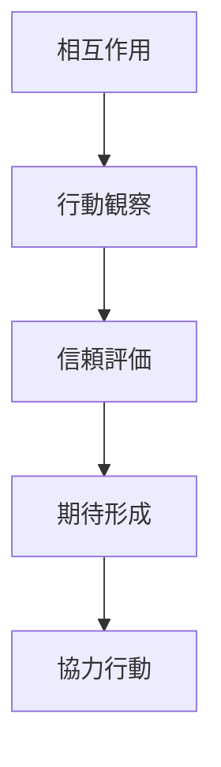
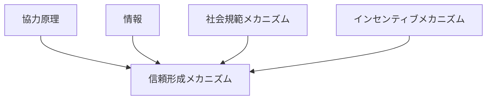

# 信頼形成メカニズム

## 定義

主体が

- 他者
- 組織
- 制度

に対して

**将来の行動が予測可能で、裏切られにくいと期待するようになる過程**

を **信頼形成メカニズム** という。

---

# 基本構造



つまり

```text
相互作用
↓
観察
↓
評価
↓
期待形成
↓
協力
```

である。

---

# 信頼の本質

## 1 不確実性を下げる

信頼とは

```text
相手がどう動くか分からない
```

という不確実性を下げる働きである。

信頼が高いほど

- 監視
- 契約
- 防衛

のコストが下がる。

---

## 2 協力を可能にする

信頼がないと主体は

- 裏切り
- 搾取
- 未履行

を警戒する。

そのため信頼は

**協力成立の前提条件**

になりやすい。

---

## 3 反復で形成される

信頼は一回で完成することもあるが、通常は

- 反復的相互作用
- 一貫した履行
- 期待の確認

を通じて蓄積される。

---

# 信頼形成の主要要因

## 1 一貫性

過去の行動が安定しているほど、信頼は形成されやすい。

---

## 2 能力

善意だけでなく

```text
約束を守れる能力
```

があるかも重要である。

---

## 3 誠実性

利害が変わっても裏切りにくいという期待が必要である。

---

## 4 可視性

相手の行動が観察できるほど、信頼評価は成立しやすい。

---

## 5 制度的裏付け

契約、法、規範、仲介者などがあると信頼形成は容易になる。

---

# kernelとの関係



---

# 情報との関係

信頼形成には

- 行動履歴
- 評判
- 実績
- 第三者情報

が必要である。

つまり信頼は

**情報に基づく期待形成**

でもある。

---

# 社会規範との関係

規範が強い共同体では

```text
裏切りは悪い
```

という共有期待があるため、信頼が形成されやすい。

---

# インセンティブとの関係

制裁や報酬が適切なら

```text
裏切るより守る方が得
```

となる。

このとき信頼は

**人格への信頼**だけでなく  
**制度に埋め込まれた信頼**として成立する。

---

# 評判との関係

直接経験がなくても

- 口コミ
- レビュー
- 履歴
- 紹介

によって信頼は形成される。

この意味で評判は

**信頼の外部記憶装置**

である。

---

# 信頼の型

## 対人的信頼

個人同士の信頼。

例

- 友人
- 上司部下
- 取引先担当者

---

## 制度的信頼

制度や仕組みに対する信頼。

例

- 法制度
- 銀行
- プラットフォーム

---

## 役割信頼

人そのものではなく役割への信頼。

例

- 医師
- 運転士
- 会計士

---

# 各領域での例

## 経済

- 商取引
- ブランド信頼
- 継続契約

---

## 組織

- チーム運営
- 権限委譲
- 上司への信頼

---

## 社会

- 政府信頼
- 司法信頼
- 地域共同体

---

## デジタル

- ECレビュー
- フリマ取引
- プラットフォーム評価

---

# pattern

信頼形成メカニズムから現れやすいパターン

- 長期協力
- 信頼ネットワーク
- 社会資本形成
- 信頼崩壊
- 評判依存

---

# case

- 継続取引
- オンラインレビューシステム
- チームプロジェクト
- 地域互助
- ブランドロイヤルティ

---

# 見分けるための問い

- 誰が誰を信頼しているか
- 何に基づいて信頼が形成されたか
- 信頼は直接経験か、評判か、制度か
- 裏切りのコストは何か
- 信頼が崩れる条件は何か

---

# 要約

信頼形成メカニズムとは

**相互作用、観察、評価を通じて相手や制度への期待が形成され、協力や継続関係が成立する仕組み**

である。

したがって信頼とは単なる感情ではなく、

```text
情報
+
期待
+
規範
+
制度
```

によって支えられる社会的メカニズムである。