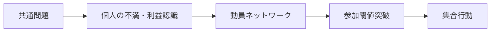

# Collective Action Mechanism

Collective Action Mechanism（集合行動メカニズム）とは、多数の主体が共通利益または共通目標のために、個別行動を超えて協調的に動員・行動する仕組みである。

---

# 概要

集合行動は、単に人が多く集まることではない。  
各個人が「自分一人では変わらない」という状況を超えて、「今なら参加する意味がある」と判断したときに立ち上がる。

そのため集合行動メカニズムの核心は、

1. 共通問題の認識
2. 参加閾値の突破
3. 動員の媒介
4. 協調的可視化
5. 維持資源の供給

にある。

---

# Kernel

- [[公共財原理]]
- [[02_zettelkasten/Zettelkasten Engine/01_knowledge/world_model/kernel/social/協力原理]]
- [[閾値原理]]
- [[動員原理]]

---

# 基本構造

---

# メカニズム

## 1. 共通問題の認識
個々人が抱える不満や課題が、私的問題ではなく共有問題として理解される。

## 2. 動員チャネルの形成
組織、SNS、地域共同体、政党、労組などが参加を媒介する。

## 3. 閾値突破
「他にも参加者がいる」と見えることで、参加コストが下がり、行動が連鎖する。

## 4. 協調の可視化
デモ、署名、集会、ハッシュタグなどが参加者の存在を可視化し、さらなる参加を呼ぶ。

## 5. 維持資源の供給
時間、資金、正当化物語、組織インフラがないと集合行動は持続しない。

---

# 成立条件

- 共通の争点がある
- 参加を媒介する組織やネットワークがある
- 参加が可視化される
- 抑圧コストより期待便益が高い
- 行動の正当化物語が共有される

---

# 失敗条件

- 不満が私事化されている
- 参加者同士が互いを観測できない
- フリーライドが多い
- 指導層や調整装置がない
- 弾圧やコストが高すぎる

---

# 発生するPattern

- [[02_zettelkasten/Zettelkasten Engine/01_knowledge/world_model/pattern/social/case/社会運動]]
- [[革命]]
- [[ストライキ]]
- [[署名運動]]
- [[ボイコット]]
- [[オンライン動員]]

---

# Case

- 労働争議
- 学生運動
- 独立運動
- 環境運動
- SNS発の抗議キャンペーン

---

# 関連ノート

- [[Cooperation Mechanism]]
- [[Free Rider Mechanism]]
- [[02_zettelkasten/Zettelkasten Engine/01_knowledge/world_model/mechanism/information/情報拡散メカニズム]]
- [[02_zettelkasten/Zettelkasten Engine/01_knowledge/world_model/mechanism/information/物語形成メカニズム]]