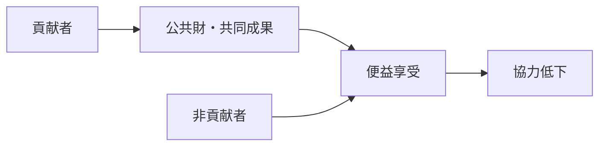

# Free Rider Mechanism

Free Rider Mechanism（フリーライダーメカニズム）とは、公共財や共同成果の利益を享受しながら、自らは十分な負担や貢献を行わない主体が生まれる仕組みである。

---

# 概要

公共財は、いったん成立すると、貢献者以外にも便益が及びやすい。  
そのため各主体には「自分は負担せず、他人が負担した成果だけ受け取る」誘因が生まれる。

これが広がると、協力秩序や集合行動が崩壊する。

フリーライダーメカニズムの核心は、

1. 非排除性
2. 個人負担と共同利益の乖離
3. 監視困難
4. 貢献者の疲弊
5. 協力崩壊

にある。

---

# Kernel

- [[公共財原理]]
- [[合理的選択原理]]
- [[負担回避原理]]
- [[監視困難性]]

---

# 基本構造

---

# メカニズム

## 1. 非排除性
公共財は、対価を払わない者まで利用しやすい。

## 2. 個人合理性
各主体にとっては、自分だけ負担を避けた方が短期利益は大きい。

## 3. 貢献の不可視性
誰がどれだけ負担したかが見えにくいと、ただ乗りが検出されにくい。

## 4. 貢献者の不公平感
真面目に負担している者が損をしていると感じると、協力意欲が低下する。

## 5. 全体崩壊
一定以上フリーライダーが増えると、公共財そのものが維持不能になる。

---

# 成立条件

- 公共財が非排除的である
- 個別貢献の追跡が難しい
- 制裁がない
- 短期利益が優先される
- 負担が偏在している

---

# 抑制条件

- 貢献の可視化
- 制裁や参加条件
- 小集団での相互監視
- 評判メカニズム
- 規範的内面化

---

# 発生するPattern

- [[税逃れ]]
- [[公共財問題]]
- [[組織内ただ乗り]]
- [[観客民主主義]]
- [[参加率低下]]

---

# Case

- 労組費を払わず成果だけ享受
- 町内会の担い手固定化
- 共同開発での貢献偏り
- 安全保障のただ乗り
- 無料サービスへの過剰依存

---

# 関連ノート

- [[Collective Action Mechanism]]
- [[Cooperation Mechanism]]
- [[02_zettelkasten/Zettelkasten Engine/01_knowledge/world_model/mechanism/institutional/ルール執行メカニズム]]
- [[02_zettelkasten/Zettelkasten Engine/01_knowledge/world_model/mechanism/institutional/規範形成メカニズム]]