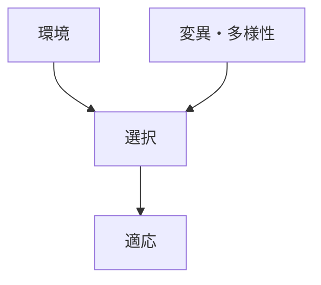
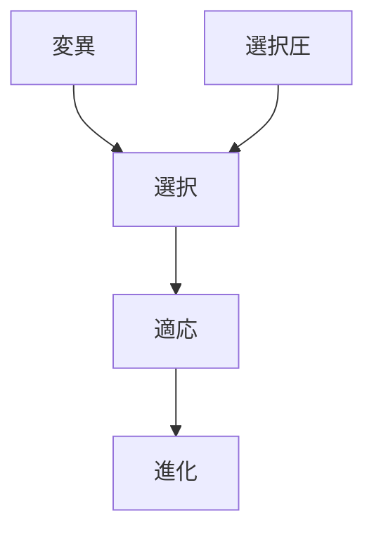

# 適応

## 定義

主体・生物・組織・システムが  
環境条件や制約に対して

**より生存・存続しやすい形へ変化する過程**

を **適応（Adaptation）** という。

---

# 基本構造



つまり

```
環境
+
多様性
+
選択
↓
適応
```

である。

---

# 適応の本質

## 1 環境との適合

適応とは

```
環境条件
↓
生存に有利
```

となる変化である。

---

## 2 完全ではない

適応は

```
最適
```

ではなく

```
十分に生存可能
```

な状態である。

---

## 3 動的である

環境が変われば

```
適応
↓
再適応
```

が必要になる。

---

# kernelとの関係



---

# 適応と進化

進化は

```
変異
+
選択
+
適応
```

によって進む。

---

# 適応と制約

適応は

```
制約の中で
最も生存可能な形
```

を作る。

---

# 各領域での例

## 生物

- 保護色
- 体温調整
- 捕食回避

---

## 経済

- 企業戦略変化
- 市場適応
- 技術革新

---

## 組織

- 業務改革
- 組織構造変化
- 分業

---

## 技術

- プロトコル進化
- ソフトウェア改善
- 設計最適化

---

## 都市

- 都市構造変化
- 交通システム適応

---

# pattern

適応から現れるパターン

- 特化
- 分化
- 効率化
- 構造変化

---

# case

- キリンの首
- 抗生物質耐性
- 技術進化
- 企業モデル変化

---

# 見分けるための問い

- どの環境条件に適応しているか
- どの形質が有利になったか
- どの制約に対応しているか
- 適応の代償は何か

---

# 要約

適応とは

**環境条件や制約の中で生存・存続に有利な形へ変化する過程**

であり、  
進化やシステム変化の基本原理である。